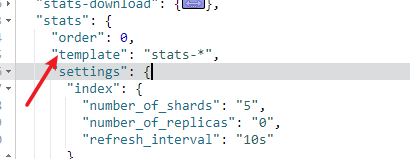

# ElasticSearch

### 简介和一些原理

简介：Elaticsearch，简称为es， es是一**个开源的高扩展的分布式全文检索引擎,主要用于站内搜索，能够对搜索进行分词查询。**

**作用：用来做关键词搜索，例如京东、淘宝**

es用来将你要搜索的东西罗列出来，他保存的是一些关键字(就是作为关键字用来搜索商品的一些关键字)，MySQL用来当你点某个商品的时候进行查询这个商品的详细信息

**强一致性**：保证数据实时同步

**弱一致性**：不要求数据同时同步，最终数据统一即可

MySQL：底层使用B+Tree的方式进行查询

es底层是通过倒排索引的方式进行查询的

**倒排索引**：es底层有一个文档库，保存商品详细的信息，还有一个分词库，保存商品有可能被搜索的一些属性，和文档库里面商品的id，当用户进行搜索的时候先去分词库中查，分词库进行分词，将这些分过后的词对应的文档id全部拉取到本地


### 使用场景

* 为用户提供按关键字查询的全文搜索功能。
* (分析用户行为，精准营销例如：用户鼠标在哪个商品上，图片上停留的时间，对商品的点击量，查看评论的条数。ElasticSearch在数据库的排行榜比较靠前2019年第7)
* 著名的ELK框架(**ElasticSearch**,**Logstash**,**Kibana**)，实现企业海量日志的处理分析的解决方案。是大数据领域的重要一份子。
  * ELK是Elasticsearch、Logstash、Kibana三大开源框架首字母大写简称。市面上也被成为Elastic Stack。
  * Elasticsearch是一个基于Lucene、分布式、通过Restful方式进行交互的近实时搜索平台框架。应用于程序搜索、网站搜索、企业搜索、日志处理和分析、基础设施指标和容器监测、应用程序性能监测、地理空间数据分析和可视化、安全分析、业务分析等。
  *  Logstash 是 Elastic Stack 的核心产品之一，可用来对数据进行聚合和处理，并将数据发送到 ElasticSearch。Logstash 是一个开源的服务器端数据处理管道，允许您在将数据索引到 Elasticsearch 之前同时从多个来源采集数据，并对数据进行充实和转换。
  * Kibana 是一款适用于 Elasticsearch 的数据可视化和管理工具，可以提供实时的直方图、线形图、饼状图和地图。Kibana 同时还包括诸如 Canvas 和 Elastic Maps 等高级应用程序；Canvas 允许用户基于自身数据创建定制的动态信息图表，而 Elastic Maps 则可用来对地理空间数据进行可视化。

### es中的相关概念

先说Elasticsearch的文件存储，Elasticsearch是面向文档型数据库，一条数据在这里就是一个文档，用JSON作为文档序列化的格式

**与mysql的对照：**


#### 索引 index

一个索引就是一个拥有几分相似特征的文档的集合。比如说，你可以有一个客户数据的索引，另一个产品目录的索引，还有一个订单数据的索引。一个索引由一个名字来标识（必须全部是小写字母），并且当我们要对这个索引中的文档进行索引、搜索、更新和删除的时候，都要使用到这个名字。在一个集群中，可以定义任意多的索引。

能搜索的数据必须索引，这样的好处是可以提高查询速度，比如：**新华字典**前面的目录就是索引的意思，目录可以提高查询速度。

Elasticsearch索引的精髓：一切设计都是为了提高搜索的性能。

#### 类型 type

在一个索引中，你可以定义一种或多种类型。

一个类型是你的索引的一个逻辑上的分类/分区，其语义完全由你来定。通常，会为具有一组共同字段的文档定义一个类型。

#### 字段Field

相当于是数据表的字段，对文档数据根据不同属性进行的分类标识。

#### 映射 mapping

mapping是处理数据的方式和规则方面做一些限制，如：某个字段的数据类型、默认值、分析器、是否被索引等等。

这些都是映射里面可以设置的，其它就是处理ES里面数据的一些使用规则设置也叫做映射，按着最优规则处理数据对性能提高很大，因此才需要建立映射，并且需要思考如何建立映射才能对性能更好。

#### document

一个文档是一个可被索引的基础信息单元。

比如：你可以拥有某一个客户的文档，某一个产品的一个文档，当然，也可以拥有某个订单的一个文档。文档以JSON（Javascript Object Notation）格式来表示，而JSON是一个到处存在的互联网数据交互格式。

在一个index/type里面，你可以存储任意多的文档。注意，尽管一个文档，物理上存在于一个索引之中，文档必须被索引/赋予一个索引的type。

#### 接近实时

ElasticSearch是一个接近实时（Near Real Time，简称NRT）的搜索平台。这意味着，从索引一个文档直到这个文档能够被搜索到有一个轻微的延迟（通常是1秒以内）。

### es中的命令

* IK分词器有两种分词模式：ik_max_word和ik_smart模式。
  *  ik_max_word：会将文本做最细粒度的拆分
  * ik_smart：会做最粗粒度的拆分，智能拆分
* 适用语法：GET _analyze
  {
    "analyzer": "ik_smart", 
    "text":"我是一个中国人"
  }

> **在es中只有布尔类型和数值类型不用加双引号，其他都必须使用双引号**

#### 创建索引库（index）

* **创建索引**
  * PUT /自定义的索引名称（小写英文单词）
* **分片**：默认我们自己按创建的索引库是由5个分片组成的，加粗的为主分片，五角星标记的为主节点


* **查看索引**
  * 查看所有索引
    * GET /_cat/indices?v
  * 查看某个索引
    * get /索引名

**查看索引的表头含义：**


* **删除索引**
  * delete /索引名

#### 类型及映射操作

- **创建类型及映射方式一**：

  - 先创建索引index：PUT /自定义索引名

  - 在创建类型及映射：PUT /自定义索引名/类型/_mapping/
    { 

    "字段名称1":{

       "type【类型】": "类型"（支持索引查询为text反之keyword）,

       "index【是否索引】": true（支持索引查询为true反之false）,

       "store【是否存储】": false（一般为false）,

       "analyzer【分词器】": "具体分词器"

      } ,

    "字段名称2":{

       "type【类型】": "类型"（支持索引查询为text反之keyword）,

       "index【是否索引】": true（支持索引查询为true反之false）,

       "store【是否存储】": false（一般为false）,

       "analyzer【分词器】": "具体分词器"

      },

    .............

    }

- **方式二直接创建索引、类型和映射**

  - PUT /自定义索引名/
    {
    "mappings": {
      "自定义类型":{

    ​	"properties":{
    ​	"字段名称1":{

       "type【类型】": "类型"（支持索引查询为text反之keyword）,

       "index【是否索引】": true（支持索引查询为true反之false）,

       "store【是否存储】": false（一般为false）,

       "analyzer【分词器】": "具体分词器"

      }，

    "字段名称2":{

       "type【类型】": "类型"（支持索引查询为text反之keyword）,

       "index【是否索引】": true（支持索引查询为true反之false）,

       "store【是否存储】": false（一般为false）,

       "analyzer【分词器】": "具体分词器"

      }

    ..............	   		

    ​    }

      }
    }
    }

- **type**：类型，Elasticsearch中支持的数据类型非常丰富，说几个关键的：

  * ①String类型，又分两种：
    * text：可分词
    * keyword：不可分词，数据会作为完整字段进行匹配
  * ②Numerical：数值类型，分两类
  * 基本数据类型：long、integer、short、byte、double、float、half_float
    * 浮点数的高精度类型：scaled_float
  * ③Date：日期类型
  * ④Array：数组类型
  * ⑤Object：对象

-  **index**：是否索引，**默认为true**，也就是说你不进行任何配置，所有字段都会被索引。

  * true：字段会被索引，则可以用来进行搜索
  * false：字段不会被索引，不能用来搜索

- **store**：是否将数据进行独立存储，默认为false

  * 原始的文本会存储在**_source**里面，默认情况下其他提取出来的字段都不是独立存储的，是从_source里面提取出来的。当然你也可以独立的存储某个字段，只要设置"store": true即可，获取独立存储的字段要比从_source中解析快得多，但是也会占用更多的空间，所以要根据实际业务需求来设置。

- **analyzer**：分词器，这里的**ik_max_word**即使用**ik分词器**


* **查看类型映射**
  * GET /要查看的索引名/要查看的类型/_mapping

#### 文档操作【基本CURD操作】

- **往索引库添加文档信息**
  - 添加信息
    - POST /索引库名/索引库中的类型
        "字段名1":"小米手机",
        "字段名2":"米粉",
        "字段名3":"are you ok.jpg",
        "字段名4":1999
      }
  - 添加信息并自定义id
    - POST /索引库名/索引库中的类型/指定id（如：1）
        "字段名1":"小米手机",
        "字段名2":"米粉",
        "字段名3":"are you ok.jpg",
        "字段名4":1999
      }
- **往索引库查看文档信息**
  - 查看单个文档
    - GET /自定义索引库名/类型/id名
  - 查看所有文档
    - GET /自定义索引库名/类型/_search
- **往索引库修改文档信息**
  - 覆盖式修改（跟添加一样，覆盖式修改如果修改时少了某些字段那么修改后的内容里删除的哪些字段为空）
  - 根据id修改某一个字段（局部修改，只修改某个字段其他内容保持原来的不变）
    - POST /自定义索引库名/类型/要修改的id/_update
      {
        "doc":{
          "要修改的字段名":"苹果手机手机"
        }
      }
- **往索引库删除文档信息**
  - 根据id删除
    - DELETE /要删除的索引库名/索引库名的类型/id
  - 根据查询条件删除
    - POST /要删除的索引库名/_delete_by_query
      {
        "query":{
         "以哪种方式查询(有四种方式)":{
            "字段名":"手机"
         }
        }
      }

#### 请求体查询【基本查询】

GET /{索引库}/_search

{

  "query":{

​    "查询类型":{

​      "查询条件":"查询条件值"

​    }

  }

}

"query"：这里的query代表一个查询对象，里面可以有不同的查询属性

* "查询类型"：例如：

  * **match_all**  查询所有

  * **match**     分词查询，会将你的查询条件进行分词使用或的关系查询，匹配度高的在最上面

    * 里面有一个"operator": "or"属性，默认是or(也就是分词之间是or的关系)，可以改为and

  * **multi_match**    多字段匹配查询

    * GET /索引库/_search
      {
        "query": {
          "multi_match": {
            "query": "华为",
            "fields": ["字段1","字段2"]
          }
        }
      }

  * **term**  精确查询，不对条件进行分词，去分词库中查询

  * **terms**   多关键词查询，相当于传统关键数据库MySQL中的in

    例：GET /shopping/_search
    {
      "query": {
        "terms": {
          "price": [
            "3999",
            "4999"
          ]
        }
      }
    }

#### 请求体查询【结果过滤】

- **方式一**

GET /索引库/\_search
{
  "_source": ["要排除的字段1","要排除的字段2"], 
  "query": {
    "四种查询方式": {
      "查询字段": "查询条件"
    }
  }
}

- **方式二**

GET /shopping/\_search
{
  "_source": {
    "includes": ["字段名1","字段名2"],   **表示包含**
    "excludes": "字段名3"  **表示排除**
  },  
  "query": {
    "四种基本查询方法任意一个": {
      "字段名":"条件"
    }
  }
}

#### 请求体查询【高级查询】

- **bool**`bool`把各种其它查询通过`must`（必须 ）、`must_not`（必须不）、`should`（应该）的方式进行组合

  - GET /shopping/_search
    {
      "query": {
        "bool": {
          "must": [
            {
              "match": {
                "title": "小米"
              }
            }
          ],
          "must_not": [
            {
              "match": {
                "title": "手机"
              }
            }
          ],
          "should": [
            {"match": {
              "title": "电视"
            }}
          ]
        }
      }
    }

- **range**  范围查询，range 查询找出那些落在指定区间内的数字或者时间。range查询允许以下字符

- gt == (greater than)    大于>

- gte == (greater than equal)   大于等于>=

- lt == (less than)    小于<

- lte == (less than equal)     小于等于<=

  - GET /shopping/_search
    {
      "query": {
        "range": {
          "price": {
            "gte": 2000,
            "lte": 5000
          }
        }
      }
    }

- **fuzzy** 模糊查询（纠错查询）

- 术语的长度生成编辑距离

  - **0..2**

    - 必须完全匹配

  - **3..5**

    - 允许一次编辑（可以写错一个）

  - **>5**

    允许进行两次编辑（可以写错两个）

  - **"fuzziness": 数字**     设置可以写错几个在一个字符串中（**最多纠错两次**）

GET /shopping/_search
{
  "query": {
    "fuzzy": {
      "title": {
        "value": "eppla"   （这里原来是apple）
        , "fuzziness": 2
      }
    }
  }
}

#### 请求体查询【查询排序】

GET /shopping/\_search
{
  "query": {
    "match_all": {}
  },
  "sort": [
    {
      "price": {
        "order": "desc"
      }
    },
    {
      "_id":{
        "order": "asc"
      }
    }
  ]
}

现根据价格查降序，后根据id升序

#### 请求体查询【高亮查询】

- highlight属性
  -   **pre_tags**：前置标签
  -   **post_tags**：后置标签
  -   **fields**：需要高亮的字段

GET /shopping/_search
{
  "query": {
    "match": {
      "title": "华为"
    }
  },
  "highlight": {
    "pre_tags": "<font color='red'>",
    "post_tags": "</font>",
    "fields": {
      "title": {}
    }
  }
}

#### 请求体查询【分页查询】

- from：当前页的起始索引，默认是从0开始显示（**也就是从第几条开始显示**）

- size：每页显示多少条

GET /shopping/_search
{
  "query": {
    "match": {
      "title": "手机"
    }
  },
  "from": 2,
  "size": 2
}

### 补充

> ES模板：当你设定为模板后(如模板名为status*)，那么带status开头的索引的字段映射都会遵循模板创建好的映射关系
>
> 查看所有模板：GET /_template
>
> 

#### 批量插入

- post /索引名/_bulk

  {index:{"_id" : 指定id}}

  {你要添加的内容} (添加格式为："字段名" : 值)

  {index:{"_id" : 指定id}}

  {你要添加的内容} (添加格式为："字段名" : 值)

  {index:{"_id" : 指定id}}

  {你要添加的内容} (添加格式为："字段名" : 值)

> **其中id可以为空，添加数据时自动生成,若id自动生成可写为{index:{}}**

#### 批量查询(可以查询不同索引下的内容)

- GET _mget

  {

  ​	"docs":[

  ​		{index : "索引名"，"_id" : "id值"}，

  ​        {index : "索引名"，"_id" : "id值"}，

  ​        {index : "索引名"，"_id" : "id值"}，

  ​        {index : "索引名"，"_id" : "id值"}，

  ​	]

  }

#### 查询补充

- GET 索引名/_search?q=值   **这里的q表示query的意思，他会把文档中不管哪个字段=值的数据查出**

- GET 索引名/_search?q=值&df=字段名   **这里df表示你要查询那个字段等于你所输入的值，只会查出指定字段等于你所赋的值的结果**

- <font color =red>查询多值示例：查询多值：GET /stats-dzpins-hits/_search?q=pin_board_id:23589304 AND action_uid:92540571</font>

- **简写方式**：GET 索引名/_search?q=字段名 : 值

- **查询一个字段包含多个词的情况(不写and默认多个值是or的关系)**：GET 索引名/_search?q=字段名 : 值1  值2    中间用空格隔开即可

  - 或者GET 索引名/_search?q=字段名 : （值1  值2）    中间用空格隔开即可

  - GET 索引名/_search?q=字段名 : （值1  -值2）  负号表示不包含(即包含值1，不包含值2)

  - 同时包含多个值：GET 索引名/_search?q=字段名 : （值1  <font color="red">AND</font>  值2）  即包含值1，又包含值2

  - > **注意这里的AND要大写，如果是小写，他会认为你要查包含and的字段**
    >
    > **如果查询的字符串中有空格，那么要用双引号，如："my name is dyh",这样他会把这句话当成一个词去查**

- **模糊查询：**可以使用<font color="red">？</font>(代表一个字符)，<font color="red">*</font>代表多个字符

- **contant_score**字段是不会对查询结果进行算分，并且还会对查询进行缓存，从而提高查询效率，filter和must_not具有相同作用

  - 用法：{"query":{"contant_score":{"filter":{里面是term、terms或range查询}}}}

- match_phrase: 相对于match就是不会分词，会把你的值当作一个词去词库中查（类似于term精确匹配）

#### 聚合

##### 单值查询

- min      最小值
- max     最大值
- sum     总和
- avg       平均值
- cardinality     统计数量
- **语法**
  - {
      "aggs": {
        "自定义桶名": {
          "单值的操作(min、max.....)": {
            "field": "字段名"
          }
        }
      }
    }

##### 多值查询

- stats    能够查出上方单值的数据(包含最大值、最小值、数量等)   **注意：**<font color="red">字段名只能是数值类型</font>
- **语法**
  - {
      "aggs": {
        "自定义桶名": {
          "stats": {
            "field": "字段名"
          }
        }
      }
    }
- terms    对某个属性进行一个分组，然后统计出一个总数
- **语法**
  - {
      "aggs": {
        "自定义桶名": {
          "terms": {
            "field": "字段名"
          }
        }
      }
    }
- top_hits  指定取几条数据
- range      取区间的数据 (from表示从哪里开始，to到哪里结束，前包后不包)
- histogram    指定一个区间值，他会按这个区间进行一个划分(比如薪资的区间指定为1000，则没1000会分一个组)
  - 扩展：还可以指定扩展区间，如果扩展区间指定的比实际小则按实际划分，如果过大，则按照指定区间划分，不过大于实际区间后的值都为空(**基本不用，作为了解**)
- min_bucket   获取最小的桶(可以在嵌套桶时使用，根据上方桶得到的结果拿到最小的桶)
  - "自定义桶名":{
          "min_bucket": {
            "buckets_path": "上方的自定义桶名1>上方的自定义桶名2>....."
          }
        }
    - **解释：**
      - buckets_path表示路径的意思
      - \> 表示到那个路径，如果上方桶嵌套了桶就要从最外层的自定义桶名开始，如果没有嵌套则只需要写一层桶名即可

### 今天所有的练习代码

```json
GET _search
{
  "query": {
    "match_all": {}
  }
}

GET _analyze
{
  "analyzer": "ik_smart", 
  "text":"我是一个中国人"
}
#查看所有索引
GET /_cat/indices?v
#创建索引
PUT /goods

#查看某一个索引get /索引名
GET /goods

#删除一个索引 delete /索引名
DELETE /goods

#创建类型及映射

PUT /shopping

PUT /shopping/product/_mapping/
{
  "properties": {
    "title":{
      "type": "text",
      "index": true,
      "store": false,
      "analyzer": "ik_max_word"
    },
    "subtitle":{
      "type": "text",
      "index": true,
      "store": false,
      "analyzer": "ik_max_word"
    },
    "images":{
      "type": "keyword",
      "index": false,
      "store": false
    },
    "price":{
      "type": "integer",
      "index": true,
      "store": false
    }
      
  }
}


#查询类型映射
GET /shopping/


#直接创建类型和映射
PUT /shopping2/
{
"mappings": {
  "product":{
    "properties":{
       "title":{
      "type": "text",
      "index": true,
      "store": false,
      "analyzer": "ik_max_word"
    },
    "subtitle":{
      "type": "text",
      "index": true,
      "store": false,
      "analyzer": "ik_max_word"
    },
    "images":{
      "type": "keyword",
      "index": false,
      "store": false
    },
    "price":{
      "type": "integer",
      "index": true,
      "store": false
    }
    }
  }
}
}

GET /shopping2/product/_mapping

DELETE /shopping2

#往类型里面添加文档
POST /shopping/product
{
  "title":"小米手机",
  "subtitle":"米粉",
  "images":"are you ok.jpg",
  "price":1999
}

#查看文档内容通过id
GET /shopping/product/KWjrDncByTgkjNAepMbB


#添加文档自己制定id
POST /shopping/product/2
{
  "title":"苹果手机",
  "subtitle":"果粉",
  "images":"apple.jpg",
  "price":8999
}

#通过自定义id查看文档内容
GET /shopping/product/1

#查看所有的文档
GET /shopping/product/_search

#修改手机，全部修改，跟添加一样在里面改内容即可(如果只修改一个字段其他删除的话那么修改后就直接为空了)
POST /shopping/product/1
{
  "title":"锤子手机",
  "subtitle":"果粉",
  "images":"apple.jpg",
  "price":8999
}

#局部修改，只修改某个字段其他内容保持原来的不变
POST /shopping/product/1/_update
{
  "doc":{
    "title":"苹果手机手机"
  }
}


#通过id删除文档
DELETE /shopping/product/1


#通过查询条件删除
POST /shopping/_delete_by_query
{
  "query":{
   "match":{
      "title":"手机"
   }
  }
}


#基本查询##########################基本查询#####################

POST /shopping/product/1
{
    "title":"小米手机",
    "images":"http://www.gulixueyuan.com/xm.jpg",
    "price":3999.00,
    "subtitle":"华为"
}
 
POST /shopping/product/2
{
    "title":"华为手机",
    "images":"http://www.gulixueyuan.com/hw.jpg",
    "price":4999.00
}
 
POST /shopping/product/3
{
    "title":"小米电视",
    "images":"http://www.gulixueyuan.com/xmds.jpg",
    "price":5999.00
}

POST /shopping/product/4
{
    "title":"apple手机",
    "images":"http://www.gulixueyuan.com/apple.jpg",
    "price":5999.00
}
 
POST /shopping/product/5
{
    "title":"apple",
    "images":"http://www.gulixueyuan.com/apple.jpg",
    "price":4999.00
}


GET /shopping/_search

#查询所有
GET /shopping/_search
{
  "query":{
    "match_all": {
      
    }
  }
}

#match 分词查询，会将你的查询条件进行分词使用或的关系查询，匹配度高的在最上面
GET /shopping/_search
{
  "query": {
    "match": {
      "title": "小米手机"
    }
  }
}
#让match的分词使用and的关系

GET /shopping/_search
{
  "query": {
    "match": {
      "title": {
        "query": "小米手机",
        "operator": "and"
      }
    }
  }
}

#在多个字段中搜索你的查询条件
GET /shopping/_search
{
  "query": {
    "multi_match": {
      "query": "华为",
      "fields": ["title","subtitle"]
    }
  }
}


#关键词精确查询
GET /shopping/_search
{
  "query": {
    "term": {
      "title": {
        "value": "手机"
      }
    }
  }
}

#多关键词精确查询
GET /shopping/_search
{
  "query": {
    "terms": {
      "price": [
        "3999",
        "4999"
      ]
    }
  }
}

##########################结果过滤###############################
GET /shopping/_search
{
  "_source": ["title","images"], 
  "query": {
    "terms": {
      "price": [
        "3999",
        "4999"
      ]
    }
  }
}


GET /shopping/_search
{
  "_source": {
    "includes": ["title","price"],
    "excludes": "title"
  },  
  "query": {
    "terms": {
      "price": [
        "3999",
        "4999"
      ]
    }
  }
}
##########高级查询############################
#1.	布尔组合(bool)
GET /shopping/_search
{
  "query": {
    "bool": {
      "must": [
        {
          "match": {
            "title": "小米"
          }
        }
      ],
      "must_not": [
        {
          "match": {
            "title": "手机"
          }
        }
      ],
      "should": [
        {"match": {
          "title": "电视"
        }}
      ]
    }
  }
}
#2.	范围查询（range）
GET /shopping/_search
{
  "query": {
    "range": {
      "price": {
        "gte": 2000,
        "lte": 5000
      }
    }
  }
}
#3.	模糊查询（fuzzy）
GET /shopping/_search
{
  "query": {
    "fuzzy": {
      "title": {
        "value": "eppla"
        , "fuzziness": 3
      }
    }
  }
}

#排序
GET /shopping/_search
{
  "query": {
    "match_all": {}
  },
  "sort": [
    {
      "price": {
        "order": "desc"
      }
    },
    {
      "_id":{
        "order": "asc"
      }
    }
  ]
}
###############高亮和分页############################
#高亮
GET /shopping/_search
{
  "query": {
    "match": {
      "title": "华为"
    }
  },
  "highlight": {
    "pre_tags": "<font color='red'>",
    "post_tags": "</font>",
    "fields": {
      "title": {}
    }
  }
}


#分页
GET /shopping/_search
{
  "query": {
    "match": {
      "title": "手机"
    }
  },
  "from": 2,
  "size": 2
}
############################集群测试########################
PUT /shopping
{
  "settings": {},
  "mappings": {
    "product":{
      "properties": {
        "title":{
          "type": "text",
          "analyzer": "ik_max_word"
          
        },
        "subtitle":{
          "type": "text",
          "analyzer": "ik_max_word"
        },
        "images":{
          "type": "keyword",
          "index": false
        },
        "price":{
          "type": "float",
          "index": true
        }
      }
    }
  }
}


POST /shopping/product
{
    "title":"小米手机",
    "images":"http://www.gulixueyuan.com/xm.jpg",
    "price":3999.00
}

GET /shopping/_search
```

### Java高级客户端操作

#### 索引操作

##### 创建索引

```java
//创建请求对象 设置索引库name
CreateIndexRequest request = new CreateIndexRequest("索引名");
//客户端发送请求，获取响应对象
CreateIndexResponse response = client.indices().create(request, RequestOptions.DEFAULT);
client.close();
```

##### 查询索引

```Java
//获取这个索引
GetIndexRequest request = new GetIndexRequest("索引名");
//获取索引返回请求
GetIndexResponse response = client.indices().get(request, RequestOptions.DEFAULT);
//查看一个索引是否存在
boolean exists = client.indices().exists(request, RequestOptions.DEFAULT);
client.close();
```

##### 删除索引

```java
DeleteIndexRequest request = new DeleteIndexRequest("索引名");
AcknowledgedResponse response = client.indices().delete(request, RequestOptions.DEFAULT);

boolean acknowledged = response.isAcknowledged();
System.out.println("acknowledged = " + acknowledged);
client.close();
```

##### 创建索引的映射(还可以通过Map或者XContentBuilder的方式创建，这种最简单)

```java
PutMappingRequest request = new PutMappingRequest("索引名");
String json = "{\n" +
        "  \"properties\": {\n" +
        "    \"title\":{\n" +
        "      \"type\": \"text\",\n" +
        "      \"index\": true,\n" +
        "      \"store\": false,\n" +
        "      \"analyzer\": \"ik_max_word\"\n" +
        "    },\n" +
        "    \"subtitle\":{\n" +
        "      \"type\": \"text\",\n" +
        "      \"index\": true,\n" +
        "      \"store\": false,\n" +
        "      \"analyzer\": \"ik_max_word\"\n" +
        "    },\n" +
        "    \"images\":{\n" +
        "      \"type\": \"keyword\",\n" +
        "      \"index\": false,\n" +
        "      \"store\": false\n" +
        "    },\n" +
        "    \"price\":{\n" +
        "      \"type\": \"integer\",\n" +
        "      \"index\": true,\n" +
        "      \"store\": false\n" +
        "    }\n" +
        "      \n" +
        "  }\n" +
        "}";
request.source(json, XContentType.JSON);
AcknowledgedResponse response = client.indices().putMapping(request, RequestOptions.DEFAULT);
System.out.println("response.isAcknowledged() = " + response.isAcknowledged());
client.close();
```

##### 查看映射

```java
GetMappingsRequest request = new GetMappingsRequest();
request.indices("索引名");

GetMappingsResponse response = client.indices().getMapping(request, RequestOptions.DEFAULT);
Map<String, MappingMetaData> mappings = response.mappings();
MappingMetaData metaData = mappings.get("索引名");
Map<String, Object> asMap = metaData.getSourceAsMap();
System.out.println("asMap = " + asMap);
client.close();
```

#### 文档操作

##### 创建和更新文档

```Java
//1.创建请求对象(创建索引库CreateIndexRequest)，索引库名称、类型名称、主键id
IndexRequest request = new IndexRequest().index("索引名").type("类型").id("id");
//方式1：写一个bean对象将对象转为json字符串
//        Product product = Product.builder().id(1L).title("小米手机").price(9999.99).images("hhh.jpg").build();
//        ObjectMapper objectMapper = new ObjectMapper();
//        String string = objectMapper.writeValueAsString(product);
//        request.source(string, XContentType.JSON);

        //方式二
//        request.source(XContentType.JSON,"id","2","title","华为手机","price","1999.99");


        //方式三直接使用json传
//        request.source("{\n" +
//                "    \"title\":\"小米手机\",\n" +
//                "    \"images\":\"http://www.gulixueyuan.com/xm.jpg\",\n" +
//                "    \"price\":3999.00\n" +
//                "}",XContentType.JSON);
        //方式四，使用map方式传入
//        Map<String,Object> map = new HashMap<>();
//        map.put("title","华为手机");
//        map.put("subtitle","华为真是国产之光呢！！！");
//        map.put("price",1999);
//        request.source(map);
		//方式五
        XContentBuilder builder = XContentFactory.jsonBuilder();
        builder.startObject();
        {
            builder.field("title", "荣耀手机");
            builder.field("subtitle", "华为真不错");
            builder.field("price", "4999");
        }
        builder.endObject();
        request.source(builder);
        //2.客户端发送请求，获取响应对象
        IndexResponse response = client.index(request, RequestOptions.DEFAULT);
        System.out.println("response.getIndex() = " + response.getIndex());
        System.out.println("_type:" + response.getType());
        System.out.println("_id:" + response.getId());
        System.out.println("_result:" + response.getResult());
 		client.close();
```

##### 查询文档

```java
GetRequest request = new GetRequest("索引", "类型", "id");
//查看是否存在这个文档
boolean exists = client.exists(request, RequestOptions.DEFAULT);
System.out.println("exists = " + exists);

//查看文档里面的内容
GetResponse response = client.get(request, RequestOptions.DEFAULT);
System.out.println("response.getId() = " + response.getId());
System.out.println("response.getIndex() = " + response.getIndex());
System.out.println("response.getType() = " + response.getType());
System.out.println("response.getSourceAsString() = " + response.getSourceAsString());
client.close();
```

##### 修改文档

```java
UpdateRequest request = new UpdateRequest("shopping01","_doc","1");

//方式跟添加一样有好几种
request.doc("title","一加手机","subtitle","OnePlus","price",3999.99);

UpdateResponse response = client.update(request, RequestOptions.DEFAULT);
System.out.println("response.getId() = " + response.getId());
System.out.println("response.getIndex() = " + response.getIndex());
System.out.println("response.getType() = " + response.getType());
```

##### 删除文档

```java
DeleteRequest request = new DeleteRequest("shopping01", "_doc", "1");
DeleteResponse response = client.delete(request, RequestOptions.DEFAULT);
//打印信息
System.out.println("response.toString() = " + response.toString());
System.out.println("response.getResult() = " + response.getResult());
```

##### 批量新增、更新文档

```java
//批量添加
//        request.add(new IndexRequest("shopping01","_doc","7").source("title","oppo","subtitle","oppo真不错呢","price",2999.99));
//        request.add(new IndexRequest("shopping01","_doc","8").source("title","vivo","subtitle","vivo真不错呢","price",5999.99));
//        request.add(new IndexRequest("shopping01","_doc","9").source("title","三星","subtitle","韩国之光","price",7999.99));

        request.add(new IndexRequest().type("_doc").index("shopping01").source(XContentType.JSON, "title", "小米手机", "images", "http://www.gulixueyuan.com/xm.jpg", "price", 1999.0));
        request.add(new IndexRequest().type("_doc").index("shopping01").source(XContentType.JSON, "title", "小米电视", "images", "http://www.gulixueyuan.com/xmds.jpg", "price", 2999.0));
        request.add(new IndexRequest().type("_doc").index("shopping01").source(XContentType.JSON, "title", "华为手机", "images", "http://www.gulixueyuan.com/hw.jpg", "price", 4999.0, "subtitle", "小米"));
        request.add(new IndexRequest().type("_doc").index("shopping01").source(XContentType.JSON, "title", "apple手机", "images", "http://www.gulixueyuan.com/appletl.jpg", "price", 5999.00));
        request.add(new IndexRequest().type("_doc").index("shopping01").source(XContentType.JSON, "title", "apple", "images", "http://www.gulixueyuan.com/apple.jpg", "price", 3999.00));

      BulkResponse responseBulk = client.bulk(request, RequestOptions.DEFAULT);

        System.out.println("took:" + responseBulk.getTook());
        System.out.println("items:" + responseBulk.getItems());
		client.close();

```

##### 批量删除

```java
BulkRequest request = new BulkRequest();
request.add(new DeleteRequest("shopping01","_doc","7"));
request.add(new DeleteRequest("shopping01","_doc","8"));
request.add(new DeleteRequest("shopping01","_doc","9"));

BulkResponse bulk = client.bulk(request, RequestOptions.DEFAULT);

System.out.println("bulk.getItems() = " + bulk.getItems());
System.out.println("bulk.getTook() = " + bulk.getTook());
client.close();
```

##### 带条件的查询文档操作

```java
@RunWith(SpringRunner.class)
@SpringBootTest(classes = ElasticSearchMainApplication.class)
public class Demo04RequestBodyTest {

    @Resource
    private RestHighLevelClient client;

    //请求体查询-基本查询
    //1.创建请求对象
    //2.客户端发送请求，获取响应对象
    //3.打印结果信息
    @Test
    public void basicQuery() throws IOException {
        //1.创建请求对象
        SearchRequest searchRequest = new SearchRequest();
        searchRequest.indices("shopping01");
        searchRequest.types("_doc");
        //构建查询的请求体
        SearchSourceBuilder builder = new SearchSourceBuilder();

        //查询所有
        //sourceBuilder.query(QueryBuilders.matchAllQuery());//
        //match查询，带分词器的查询
        //sourceBuilder.query(QueryBuilders.matchQuery("title","小米手机").operator(Operator.AND));
        //term查询：不带分词器，查询条件作为关键词
        //TODO ...multi_match：多个字段的match查询
        //TODO ...terms查询：多个关键词去匹配

//        builder.query(QueryBuilders.matchAllQuery());
//        builder.query(QueryBuilders.matchQuery("title","苹果手机").operator(Operator.AND));
//        builder.query(QueryBuilders.termQuery("price",8999));
//        builder.query(QueryBuilders.termsQuery("price","3999.99","1999"));
        builder.query(QueryBuilders.multiMatchQuery("华为","title","subtitle"));

        searchRequest.source(builder);

        //2.客户端发送请求，获取响应对象
        SearchResponse response = client.search(searchRequest, RequestOptions.DEFAULT);
        //3.打印结果信息
        printResult(response);

}

    /**
     * 打印结果信息
     */
    private void printResult(SearchResponse response) {
        SearchHits hits = response.getHits();
        System.out.println("took:" + response.getTook());
        System.out.println("timeout:" + response.isTimedOut());
        System.out.println("total:" + hits.getTotalHits());
        System.out.println("MaxScore:" + hits.getMaxScore());
        System.out.println("hits========>>");
        for (SearchHit hit : hits) {
            //输出每条查询的结果信息
            System.out.println(hit.getSourceAsString());
        }
        System.out.println("<<========");
    }

    /**
     * 目标：查询的字段过滤，分页，排序
     *
     * @throws IOException
     */
    @Test
    public void fetchSourceAndSortAndByPage() throws IOException {
        //1.创建请求对象
        SearchRequest request = new SearchRequest().indices("shopping01").types("_doc");
        //构建查询的请求体
        SearchSourceBuilder builder = new SearchSourceBuilder();
        //查询所有
//        builder.query(QueryBuilders.matchAllQuery());
        //分页信息
        //当前页其实索引(第一条数据的顺序号)，from
        builder.from(0);
        //每页显示多少条size
        builder.size(3);

        //排序信息,参数一：排序的字段，参数二：顺序ASC升序，降序DESC
        builder.sort("price",SortOrder.ASC);

        //查询字段过滤
        String[] inclids = {"title","price"};
        String[] exclids = {"subtitle"};
        builder.fetchSource(inclids,exclids);

        request.source(builder);
        //2.客户端发送请求，获取响应对象
        SearchResponse response = client.search(request, RequestOptions.DEFAULT);
        //3.打印结果信息
        printResult(response);
    }

    /**
     * 高级查询
     */
    @Test
    public void boolAndRangeAndFuzzyQuery() throws IOException {
        //1.创建请求对象
        SearchRequest request = new SearchRequest().indices("shopping01").types("_doc");
        //构建查询的请求体
        SearchSourceBuilder builder = new SearchSourceBuilder();
        //高级查询的三种方式：
        //-----------------------------------------------------------------------------
//        //bool查询：查询title中必须包含小米，一定不含有电视，应该含有手机的所有商品
//        BoolQueryBuilder boolQuery = QueryBuilders.boolQuery();
//
//        boolQuery.must(QueryBuilders.matchQuery("title","小米"));
//        boolQuery.mustNot(QueryBuilders.matchQuery("title","电视"));
//        boolQuery.should(QueryBuilders.matchQuery("title","手机"));
//
//        builder.query(boolQuery);
        //-----------------------------------------------------------------------------
        //范围查询：查询价格大于3千，小于5千的所有商品
//        RangeQueryBuilder rangeQuery = QueryBuilders.rangeQuery("price");
//        rangeQuery.gte(2000);
//        rangeQuery.lte(7000);
//        builder.query(rangeQuery);
        //-----------------------------------------------------------------------------
        //模糊查询：查询包含vivo关键词的所有商品，完成模糊查询vivo
        //-----------------------------------------------------------------------------
        FuzzyQueryBuilder fuzzyQuery = QueryBuilders.fuzzyQuery("title", "viio");
        //设置纠错字数
        fuzzyQuery.fuzziness(Fuzziness.ONE);
        builder.query(fuzzyQuery);

        request.source(builder);
       //2.客户端发送请求，获取响应对象
        SearchResponse response = client.search(request, RequestOptions.DEFAULT);
        //3.打印结果信息
        printResult(response);

   }
    
    /**
    *
    *  高亮
    *
    */
       @Test
    public void highLighterQuery() throws IOException {
        //1.创建请求对象
        SearchRequest request = new SearchRequest().indices("shopping01").types("_doc");
        //2.创建查询请求体构建器
        SearchSourceBuilder builder = new SearchSourceBuilder();
        TermQueryBuilder termQuery = QueryBuilders.termQuery("title", "apple");
        builder.query(termQuery);

        //构建高亮字段
        HighlightBuilder highlightBuilder = new HighlightBuilder();
        highlightBuilder.preTags("<font color='red'>");//设置标签前缀
        highlightBuilder.postTags("</font>");//设置标签后缀
        highlightBuilder.field("title");//设置高亮字段
        builder.highlighter(highlightBuilder);

        request.source(builder);
        //3.客户端发送请求，获取响应对象
        SearchResponse response = client.search(request, RequestOptions.DEFAULT);
        //4.打印响应结果
        printResult(response);
    }

}
```

## Elasticsearch搜索引擎Suggest查询建议(ik分词器)

> https://blog.csdn.net/supermao1013/article/details/84311057
>
> https://www.cnblogs.com/bubu99/p/13593847.html

**创建模板**

```json
PUT _template/search-word-top-regex
{
  "order": 0,
  "template": "search-word-top-*",
  "settings": {
    "index": {
      "refresh_interval": "10s",
      "number_of_shards": "3",
      "number_of_replicas": "0"
    }
  },
  "mappings": {
    "aliases": {},
    "_default_": {
      "dynamic": true,
      "_all": {
        "enabled": false
      },
      "properties": {
        "timestamp": {
          "format": "yyyy-MM-dd HH:mm:ss||epoch_millis",
          "type": "date"
        },
        "kw": {
          "type": "completion",
          "analyzer": "ik_max_word",
          "fields": {
            "keyword": {
              "type": "keyword",
              "ignore_above": 256
            }
          }
        },
        "pinyin": {
          "type": "completion",
          "analyzer": "ik_max_word",
          "fields": {
            "keyword": {
              "type": "keyword",
              "ignore_above": 256
            }
          }
        }
      }
    }
  },
  "aliases": {}
}
```

## ES模板

```json
PUT _template/template_search //模板名称
{
  "order": 0, //排序
  "template": "xxx-xxx-*",  //匹配模式
  "settings": {
     "refresh_interval": "10s",  //索引刷新间隔时间
     "number_of_shards": "3",  //主分片
     "number_of_replicas": "0"  //副分片
  },
  "mappings": {    //字段映射类型
    "properties": {
      "fullTime": {
        "type": "date",
        "format": "yyyy-MM-dd HH:mm:ss.SSS"
      },
      "use_time": {
        "type": "integer"
      }
    }
  },
  "aliases": {  //别名
    
  }
}
```

## ES索引和索引之间数据的拷贝

> 文章链接：https://blog.csdn.net/wuxintdrh/article/details/119321296

```json
POST _reindex
{
  "source": {
    "index": "search-word-top-industry",
    "size": 1000
  },
  "dest": {
    "index": "search-word-top-industry2"
  }
}
```

## ES创建别名--Reindex数据迁移

> 文章地址：https://blog.csdn.net/wuxintdrh/article/details/119321296