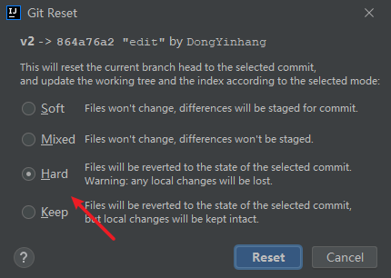

# Git

**简介**：他是一个版本控制工具，能够对书写的代码，版本进行记录，并且快速的回到某个版本

### 版本控制工具

#### git

分布式版本控制工具（底层是由多台服务器搭建的集群）

优势：

1. 即使DVCS服务端挂掉,在开发者各自电脑里面有GIT的版本库,开发者之间也是可以直接进行项目交互。
2. 可以避免中心服务器的资料丢掉之后,无法找回的情况。

#### svn

集中式版本控制工具

缺点：如果服务器宕机，会导致无法访问svn服务器上面的项目，无法继续开展工作，丢了不能找回

svn远程操作时需要借助vpn

### git工作机制

底层采用版本号的工作机制，即乐观锁的机制

### git与svn的对比优势

### git流程图

一般工作流程如下：
1．从远程仓库中克隆Git 资源作为本地仓库。
2．从本地仓库中checkout 代码然后进行代码修改
3．在提交前先将代码提交到暂存区。
4．提交修改。提交到本地仓库。本地仓库中保存修改的各个历史版本。
5．在修改完成后，需要和团队成员共享代码时，可以将代码push 到远程仓库。
上图展示了Git 的工作流程

> **一旦项目源码提交到本地库后，那么永远不会删除，除非服务器损坏**

### git常用命令

git reflog 查看历史纪录

git status 查看本地库状态

git reset --hard 版本号      回退到某个版本

git .   将整个文件夹添加到暂存区

#### 差异比较

1 . 若暂存区没有内容，工作区文件做了修改但没有提交：git diff 文件名: 工作区文件和本地库文件比较
2 . 若暂存区有内容，工作区文件做了修改但没有提交：git diff 文件名: 工作区文件和暂存区文件比较

#### 项目还原

还原有三种情况：
1. 修改后还没有被放到暂存区：从版本库还原最新版本：git checkout -- test.txt
2. 修改后已经添加到暂存区后，又作了修改：
a) 从暂存区还原: git checkout -- test.txt
b) 从指定最新版本库还原：git reset --hard HEAD
3. 修改后已经提交到版本库，从历史版本还原：git reset --hard 版本号

#### 删除两步

1. git rm 文件名
2. git commit -m 提交

### GitHub远程仓库和本地库的交互

- 从本地库往远程仓上传代码两步
  1. git remoet add  别名(一般用origin)   github的仓库地址
  2. git push 别名 master
- 从远程仓库拉去远程仓库的代码第一次使用clone，后续使用pull拉去更新的代码即可
  - git clone 远程仓库的地址  指定项目名（如果不指定默认是仓库名）

科普：

- 对称加密，用什么加密就用什么解密
- 非对称加密，用什么加密，用不同于加密的进行解密

#### ssh

ssh 模式比https 模式的一个重要好处就是，每次push、pull、fetch 等操作时，不用重复填写遍用户名密码。前提是你必须是这个项目的拥有者或者合作者，且配好了ssh key。

SSH 是英文Secure Shell 的简写形式。通过使用SSH，你可以把所有传输的数据进行加密，这样"中间人"这种攻击方式就不可能实现了，而且也能够防止DNS 欺骗和IP 欺骗。

**密钥生成命令**：ssh-keygen -t rsa(这是rsa算法)  -C  (github 邮箱地址)，使用完命令后直接全部回车即可

生成的公钥私钥对默认保存在C:\Users\用户名\.ssh 下面，.pub结尾的是公钥

#### 解决协同操作修改冲突问题

- 解决冲突三板斧：
  1. git pull，获取最新内容，修改合并
  2. git add
  3. git commit

- 文件冲突：遇到冲突先pull 更新一下在push

- 文件中的内容冲突：pull下来文件中多余的>>>>> 、  =====   和<<<<<<
  - **注意**：这种在提交的时候不需要再带文件名了

### 分支

分支的好处：

​	可以同时进行开发，提高开发效率，一个分支有问题不会对其他分支造成影响

​    一般开发一个新功能的时候创建一个新分支，一般也叫功能分支

**创建一个分支的本质是创建一个指针，切换一个分支的本质是切换指针HEAD的指向**，**HEAD默认指向master**

**HEAD默认指向master**

分支的一些命令：

### 工作流程

**流程解释：**

1）从稳定版本V1中创建dev分支，用于全权管理新功能开发（由Leader管理）。

2）在dev分支的基础上创建A分支，用于开发A功能（分支名一般为功能名或负责人名）。

3）在dev分支的基础上创建B分支，用于开发B功能。

4）A功能开发完毕后，由Leader进行code review，通过后合并到dev分支（D1合并A3），版本为D2。

5）从D2上创建一个Release分支（预发布分支），用于测试组进行测试。版本为R1。

6）R1测试发现BUG，进行修改，提交为R2。

7）R2测试通过后，认为可以上线，则与正式版V1合并，生成正式版V2。

8）由于R2是修改BUG之后的版本，这说明D2也存在相同BUG，所以D2和并R2，修复BUG，生成D3。

9）B功能开发完毕后，由Leader进行code review，通过后合并到dev分支（D3合并B5），版本为D4。

10）从D4上创建Release分支（预发布分支），用于测试组进行测试。版本为R1。

11）R1测试发现BUG，进行修改，提交为R2。

12）R2测试通过后，认为可以上线，则与正式版V2合并，生成正式版V3。

13）由于R2是修改BUF之后的版本，则说明D4页存在相同的BUG，所以D4合并R2，修改BUG，生成D5。

 

通过上述流程，V1、V2、V3分别代表三个正式版本。而dev分支中的版本也是以功能为单位的迭代。

当某个功能开发完毕（例如A分支），并且已经合并到正式版以后，则我们可以将A分支删除。

### 强制回到某次提交

1. 本地先撤回到某个分支的代码

或者

2. git push -f 强制提交覆盖掉远程仓库的代码

### IDEA使用Git向GitHub推送代码报443问题

- 打开git命令端，执行`git config --global --unset http.proxy`