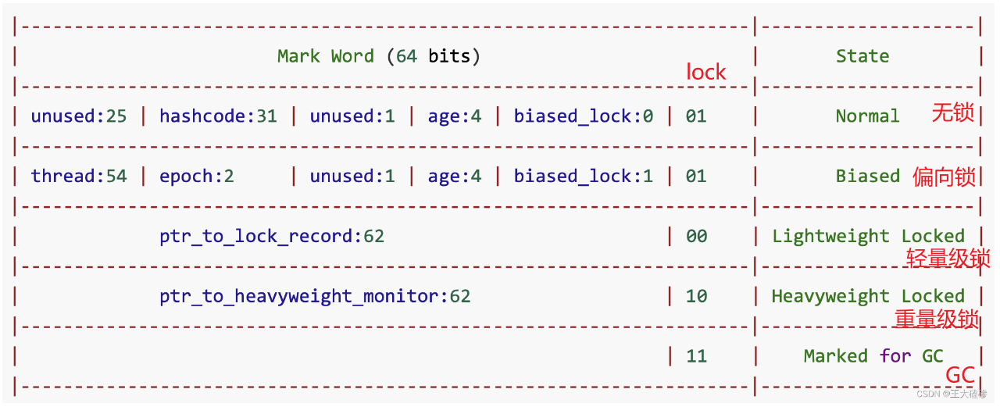
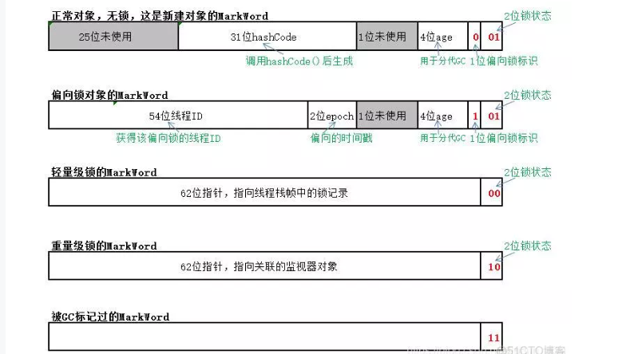

# JUC

## 什么是juc

**java.util.concurrent的缩写，为并发编程提供了一系列的框架或者工具**

## 概念回顾

**进程：**功能完善的应用程序。是系统分配资源及执行的基本单元

**线程：**一个进程由一系列的线程组成的，一个进程至少有一个线程，线程是CPU执行的基本单元，可以利用进程的资源执行业务

**并行：**同一时刻操作不同资源

**并发：**多个线程同一时间操作一个资源(操作同一个库存)

**sleep：**握着锁去睡，导致线程阻塞，是Thread类提供的方法

**wait：**松开锁去睡，不会导致线程阻塞 ，是Object提供的方法

**实现多线程的方式：**

- 继承Thread抽象类：
- 实现Runnable接口
  - 推荐使用实现接口的方式，因为java是单继承的
  - 实现接口会提示实现他的方法
  - Runnable的三种实现方式
  - 实现这个接口
  - 匿名内部类
  - lamda表达式
    - 口诀：拷贝小括号，写死右箭头，落地大括号
    - 使用lamda接口必须是函数式接口，函数式接口就是有且仅有一个**抽象方法(可以有静态方法和default方法)**，可以使用@FunctionalInterface注解标注在接口上检查是不是函数式接口
- 使用Callable+FutureTask
- 使用线程池

### synchronized(锁)

**他是一个悲观的独占的互斥的排他的可重入锁非公平的**

可重入锁：就是假如A方法中使用到了synchronized锁，他调用的B方法中也由synchronized锁，而且可以使用，这就是可重入锁

**多线程变成模板上：**

1. 线程  操作  资源类
2. 高内聚 低耦合

**实现步骤：**

1. 创建资源类
2. 资源类里创建同步方法、同步代码块
3. 多线程调用

**8锁问题：**

看下面这段儿代码，回答后面的8个问题：

```java
class Phone {

    public synchronized void sendSMS() throws Exception {
        //TimeUnit.SECONDS.sleep(4);
        System.out.println("------sendSMS");
    }

    public synchronized void sendEmail() throws Exception {
        System.out.println("------sendEmail");
    }

    public void getHello() {
        System.out.println("------getHello");
    }

}

public class Lock_8 {

    public static void main(String[] args) throws Exception {

        Phone phone = new Phone();
        Phone phone2 = new Phone();

        new Thread(() -> {
            try {
                phone.sendSMS();
            } catch (Exception e) {
                e.printStackTrace();
            }
        }, "AA").start();

        Thread.sleep(100);

        new Thread(() -> {
            try {
                phone.sendEmail();
                //phone.getHello();
                //phone2.sendEmail();
            } catch (Exception e) {
                e.printStackTrace();
            }
        }, "BB").start();
    }
}
```


多线程的8个问题：

1. 标准访问，先打印短信还是邮件
2. 停4秒在短信方法内，先打印短信还是邮件
3. 普通的hello方法，是先打短信还是hello
4. 现在有两部手机，先打印短信还是邮件
5. 两个静态同步方法，1部手机，先打印短信还是邮件
6. 两个静态同步方法，2部手机，先打印短信还是邮件
7. 1个静态同步方法，1个普通同步方法，1部手机，先打印短信还是邮件
8. 1个静态同步方法，1个普通同步方法，2部手机，先打印短信还是邮件


总结：

synchronized实现同步的基础：Java中的每一个对象都可以作为锁。具体表现为以下3种形式：

1. 对于普通同步方法，锁是当前实例对象。
2. 对于静态同步方法，锁是当前类的Class对象。
3. 对于同步方法块，锁是Synchonized括号里配置的对象

当一个线程试图访问同步代码块时，它首先必须得到锁，退出或抛出异常时必须释放锁。

也就是说：

​		如果**一个实例对象**的**非静态同步方法**获取锁后，该实例对象的其他非静态同步方法必须等待获取锁的方法释放锁后才能获取锁；可是**不同实例对象**的非静态同步方法因为用的**是不同对象的锁**，所以毋须等待其他实例对象的非静态同步方法释放锁，就可以获取自己的锁。

​		**所有的静态同步方法用的是同一把锁——类对象本身**。不管是不是同一个实例对象，只要是一个类的对象，一旦一个静态同步方法获取锁之后，其他对象的静态同步方法，都必须等待该方法释放锁之后，才能获取锁。

​		而静态同步方法（Class对象锁）与非静态同步方法（实例对象锁）之间是不会有竞态条件的。

## Lock锁

相比同步锁，JUC包中的Lock锁的功能更加强大，它提供了各种各样的锁（公平锁，非公平锁，共享锁，独占锁……），所以使用起来很灵活。

Lock是一个接口，这里主要有三个实现：ReentrantLock、ReentrantReadWriteLock.ReadLock、ReentrantReadWriteLock.WriteLock

### ReentrantLock可重入锁

> **他是一个悲观的独占的互斥的排他的可重入可公平的锁**
>
> **公平锁：按等待时长**
>
> **ReentrantLock在构造方法中有一个boolean参数可以设置为true，就会是一个公平锁**

ReentrantLock lock = new ReentrantLock（）；

lock.lock   //上锁

lock.unlock //解锁

lock.tryLock  //设置多少时长获取不到锁就自定断开

#### synchronized和ReentranLock的区别

- 相同点
  - 他们都是悲观的独占的互斥的排他的可重入锁
- 不同点
  - synchronized是一个关键字，不能看源码，ReentranLock是一个类，可以看源码
  - synchronized用法简单，不够灵活，ReentranLock用法相较复杂，但是灵活
  - synchronized不需要关心加解锁，而ReentranLock要加解锁要一致，否者会陷入死锁
  - synchronized是非公平锁，ReentranLock是可公平可不公平的锁
  - synchronized不可以响应中断，ReentranLock有一个tryLock()方法可以响应中断
  - synchronized是JVM维护的，ReentranLock是我们自己手动维护的
  - 二者线程通信方式不同
    - synchronized    wait    notify/notifyAll 实现线程通信
    - ReentranLock   Condition.await()   Condition.signal()/signalAll 

### ReentrantReadWriteLock读写锁

> **读和读是可以并发的**
>
> **写和写不可并发，会存在超卖问题**
>
> **读和写不可并发，会出现脏读问题**

**读写锁允许同一时刻被多个读线程访问，但是在写线程访问时，所有的读线程和其他的写线程都会被阻塞**

**用法：**创建读写锁对象

写锁：对象名.writeLock.lock()

解写锁：对象名.writeLock.unlock()

读锁：对象名.readLock.lock()

解读锁：对象名.readLock.unlock()

## 线程间通信

**多线程编程模板中：**

1. 判断
2. 干活
3. 通知

> notify是随机通知一个在等待的线程
>
> notifyAll是通知所有线程，让他们去抢锁，最终只有一个人能抢到锁

- 实现线程通信两套组件
  - synchronized    wait    notify/notifyAll 实现线程通信
  - ReentranLock   Condition.await()   Condition.signal()/signalAll 

> **Condition condition = lock.newCondition(); // 初始化condition对象**  

### 虚假唤醒

**多线程模板下：**防止虚假唤醒使用while循环

**存在虚假唤醒问题：**

将if判断改成while判断，因为if只会判断一次，就会往后执行代码，while会循环判断

## 并发容器类

并发容器类

- COW(copy on write 写时赋值)
  - 通俗的理解是当我们往一个容器添加元素的时候，不直接往当前容器添加，而是先将当前容器进行Copy，复制出一个新的容器，然后新的容器里添加元素，添加完元素之后，再将原容器的引用指向新的容器。这样做的好处是我们可以对CopyOnWrite容器进行并发的读，而不需要加锁，因为当前容器不会添加任何元素。所以**CopyOnWrite容器也是一种读写分离的思想，读和写不同的容器**。
  - 缺点
    - 刚写完读，可能读不到，会存在读写不一致
    - 需要多维护一个容器，浪费大量内存
    - 写的性能低
  - 优点
    - 读的性能高，适合读多写少(例如：适合黑名单)

- List
  - ArrayList线程不安全，每次扩展百分之五十
  - Vector线程安全，每次扩展百分之百
    - 性能有点低
    - 每次扩展百分之百，浪费内存
  - Condtions工具类中有一个静态内部类，SynchronizedList，这个内部类有一个有参构造器，可以传入一个List集合将他变为线程安全的
    - 缺点：迭代器没有加锁，会出现脏读
  - CopyOnWriteArrayList 线程安全的，会存在COW容器缺陷
- Set
  - HashSet  线程不安全
  - SynchronizedSet同上面SynchronizedList一样 线程安全，但是迭代器没有锁，高并发情况下可能出现脏读
  - CopyOnWriteArraySet 线程安全的，会存在COW容器缺陷
- Map
  - HashMap 线程不安全的
  - SynchronizedMap  线程安全，但是迭代器没有锁，高并发情况下可能出现脏读
  - **ConcurrentHashMap**  线程安全的，它使用了分段锁，为了既保证性能，有保证安全性，他在存在代码存在隐患的地方加了锁，源码同HashMap

## JUC强大的辅助类

### CountDownLatch(到计数器)

> 他也称闭锁，一个线程等待一组线程

**三常用的方法：**

1. 构造方法new CountDownLatch(int count)      //实例化一个倒计数器，count指定初始计数
2. countDown() // 每调用一次，计数减一
3. await()    //等待，阻塞线程，当计数减到0时，并行执行

> 扩展thread中join也是阻塞线程但是麻烦

#### CountDownLatch和join的区别

1. 都可以阻塞线程
2. join用法麻烦，需要获取线程对象才可以使用，线程池无法使用join，因为不知道是哪个线程
3. join只能在子任务执行完后进行放行，countDownLatch可以在任意地方进行放行

### CyclicBarrier(循环栅栏)

> CyclicBarrier用于等待其他线程**运行到栅栏位置**

**常用的方法：**

1. 构造方法 new CyclicBarrier(3,()->{})
   1. 第一个参数是相互等待的线程数，第二个参数是Runnable类型的线程，他是当到等待点时最后一个线程执行这个Runnable线程
2. await()    //等待方法

例：

```java
public class CyclicBarrierDemo {

    public static void main(String[] args) {

        CyclicBarrier cyclicBarrier = new CyclicBarrier(3, () -> {

            System.out.println(Thread.currentThread().getName() + " 过关了");
        });

        for (int i = 0; i < 3; i++) {
            new Thread(()->{
                try {
                    System.out.println(Thread.currentThread().getName() + " 开始第一关");
                    TimeUnit.SECONDS.sleep(new Random().nextInt(4));
                    System.out.println(Thread.currentThread().getName() + " 开始打boss");
                    cyclicBarrier.await();

                    System.out.println(Thread.currentThread().getName() + " 开始第二关");
                    TimeUnit.SECONDS.sleep(new Random().nextInt(4));
                    System.out.println(Thread.currentThread().getName() + " 开始打boss");
                    cyclicBarrier.await();

                    System.out.println(Thread.currentThread().getName() + " 开始第三关");
                    TimeUnit.SECONDS.sleep(new Random().nextInt(4));
                    System.out.println(Thread.currentThread().getName() + " 开始打boss");
                    cyclicBarrier.await();

                } catch (Exception e) {
                    e.printStackTrace();
                }
            }, String.valueOf(i)).start();
        }
    }
}
```

#### CountDownLatch和CyclicBarrier区别

1. CountDownLatch一次性的；CyclicBarrier可以反复使用。
2. CountDownLatch是一个线程或者一组线程等待另一组线程执行或者执行完；CyclicBarrier设置一组相互等待的线程
3. CyclicBarrier可以中断，CountDownLatch不能中断

### Semaphore(信号量)

控制资源的访问量，适用于请求量大而资源量紧张的场景,可以用作限流，保护关键环节，不被流量冲垮

**常用方法：**

1. 构造方法 new Semaphore(资源数量)
2. acquire()    获取资源
3. release()    释放资源

例：

```java
public class SemaphoreDemo {

    public static void main(String[] args) {
        // 初始化信号量，3个车位
        Semaphore semaphore = new Semaphore(3);

        // 6个线程，模拟6辆车
        for (int i = 0; i < 6; i++) {
            new Thread(()->{
                try {
                    // 抢占一个停车位
                    semaphore.acquire();
                    System.out.println(Thread.currentThread().getName() + " 抢到了一个停车位！！");
                    // 停一会儿车
                    TimeUnit.SECONDS.sleep(new Random().nextInt(10));
                    System.out.println(Thread.currentThread().getName() + " 离开停车位！！");
                    // 开走，释放一个停车位
                    semaphore.release();
                } catch (InterruptedException e) {
                    e.printStackTrace();
                }
            }, String.valueOf(i)).start();
        }
    }
}
```

## Callable接口

> **前两种获取线程的方式存在：无法返回子任务的返回结果集，无法捕获子线程的异常**
>
> **实现Callable接口可以获取子线程的返回结果集，可以捕获子线程的异常**

实现Callable接口他有一个泛型，是指定他返回结果集的类型，然后重写他的call方法，将他作为参数放到Thread线程中即可

因为Thread的构造器中的参数没有Callable类型的接口，所以要通过FutureTask作为桥梁，他可以放到Thread中当作参数，FutureTask的构造方法中又可以接收Callable类型

> **new Thread(new FutureTask<>(new 实现Callable的实现类))**
>
> **FutureTask是初始化一个未来任务，以便在将来的某个时刻获取任务的返回结果集，通常就用于多线程异步任务**
>
> **FutureTask有一个get方法，它可以返回子任务的结果集，但是会发生阻塞，所以尽量放到最后使用**
>
> **FutureTask的isDone方法轮询获取子任务的执行状态**
>
> **多个线程下可以复用同一个FutureTask对象已有的结果集(也就是多个线程对象同一个FutureTask结果一样)**

### Runnable和Callable的异同

1. 都是接口，都可以实现多线程编程
2. 重写方法不同，Runnable是实现run方法Callable是实现call方法
3. Callable可以通过FutureTask对象的get方法阻塞获取子任务的返回结果集
4. Callable可以通过捕获get方法的异常获取子任务的异常信息
5. Callable可以通过FutureTask对象的isDone方法轮询获取子任务的执行状态

## 阻塞队列（BlockingQueue）

特点：先进先出

**阻塞场景：**

- 队列已满，依然入队
- 队列已空，依然出队

**BlockingQueue的三个实现类**

- ArrayBlockingQueue(常用)
  - 由数组结构组成的有界阻塞队列
- LinkedBlockingQueue(不常用)   
  - 由链表结构组成的有界（但大小默认值为integer.MAX_VALUE）阻塞队列 
- SynchronousBlockingQueue(不常用)
  - 不存储元素的阻塞队列，也即单个元素的队列

它的方法可以分成以下4类(竖着看)：

|          | 抛出异常  | 特殊值   | 阻塞   | 超时                 |
| -------- | --------- | -------- | ------ | -------------------- |
| **插入** | add(e)    | offer(e) | put(e) | offer(e, time, unit) |
| **移除** | remove()  | poll()   | take() | poll(time, unit)     |
| **检查** | element() | peek()   | 不可用 | 不可用               |

**抛出异常**

​		add正常执行返回true，element（返回队列中的第一个元素）和remove移除阻塞队列中的第一个元素
​		当阻塞队列满时，再往队列里add插入元素会抛IllegalStateException:Queue full
​		当阻塞队列空时，再往队列里remove移除元素会抛NoSuchElementException
​		当阻塞队列空时，再调用element检查元素会抛出NoSuchElementException

**特定值**
		插入方法，成功ture失败false
		移除方法，成功返回出队列的元素，队列里没有就返回null
		检查方法，成功返回队列中的第一个元素，没有返回null

**一直阻塞**

​		如果试图的操作无法立即执行，该方法调用将会发生阻塞，直到能够执行。
​		当阻塞队列满时，再往队列里put元素，队列会一直阻塞生产者线程直到put数据or响应中断退出
​		当阻塞队列空时，再从队列里take元素，队列会一直阻塞消费者线程直到队列可用

**超时退出**

​		如果试图的操作无法立即执行，该方法调用将会发生阻塞，直到能够执行，但等待时间不会超过给定值。
​		返回一个特定值以告知该操作是否成功(典型的是 true / false)。

## ThreadPool线程池(重要)

> 上面三种获取线程情况无法控制线程数

**线程池的特点：**

- 可以做到线程复用
- 控制线程数
- 管理线程

**优势：**

- 降低资源消耗
- 提高响应速度
- 提高线程的可管理性

### 架构说明


Executor接口是顶层接口，只有一个execute方法，过于简单。通常不使用它，而是使用ExecutorService接口和这个接口下的ThreadPoolExecutor实现类

### Executors工具类(不推荐通过这种方式创建线程池)


### ThreadPoolExecutor线程池的7大参数(重要)

- corePollSize：核心线程池大小
- maxmumPoolSize：最大可扩展线程池大小
- keepAliveTime：生存时间
- unit：空闲时间的单位
- workQueue：阻塞队列
- threadFactory：线程工厂
- RejectedExecutionHandler：拒绝策略

### 线程池的工作原理(重要)


1. 线程初始化创建，线程数为0
2. 通过execute/submit方法向线程池提交一个任务
   1. 首先判断核心线程数是否已满，未满则创建新的线程，如果已满，接着判断阻塞队列已满，如果未满，放入阻塞队列，如果阻塞队列已满，在判断最大可扩展线程数是否已满，如果未满，则创建新的线程处理请求，如果最大可扩展线程数已满，那么则执行拒绝策略
   2. 线程执行完成任务后，会从阻塞队列中获取新的任务
   3. 如果线程空闲时间超过了keepAliveTime设置的时间，则判断当前线程是否大于核心线程，如果大于则销毁当前线程数，直至线程数的数量是核心线程数的数量

### 自定义线程池(推荐)


> **Integer.MAX_VALUE是最大整数**

**ExecutorService executorService = new ThreadPoolExecutor(7个参数)**

### 拒绝策略

- AbortPolicy：抛出异常的拒绝策略，默认
- CallerRunsPolicy：调用者执行(主线程执行)
- DiscardOldestPolicy：丢弃等待最久的
- DiscardPolicy：默默的丢弃一个(丢弃后来者)
- 自定义拒绝策略，可以使用lamda表达式

## 多线程高并发底层原理

### JMM(Java Memery Model)

JMM即为JAVA 内存模型（java memory model）。因为在不同的硬件生产商和不同的操作系统下，内存的访问逻辑有一定的差异，结果就是当你的代码在某个系统环境下运行良好，并且线程安全，但是换了个系统就出现各种问题。Java内存模型，就是为了屏蔽系统和硬件的差异，让一套代码在不同平台下能到达相同的访问结果。JMM从java 5开始的JSR-133发布后，已经成熟和完善起来。

**JMM模型：**


> **本地内存就是工作内存**
>
> **工作内存中的数据都是拷贝主内存中的副本**
>
> **线程不能直接操作主内存中的数据**
>
> 
>
> **主内存**：保存了所有的变量。
> **共享变量**：如果一个变量被多个线程使用，那么这个变量会在每个线程的工作内存中保有一个副本，这种变量就是共享变量。
> **工作内存/本地内存**：每个线程都有自己的工作内存，线程独享，保存了线程用到的变量副本（主内存共享变量的一份拷贝）。工作内存负责与线程交互，也负责与主内存交互。

**JMM对共享内存的操作做出了如下两条规定：**

1. 线程操作共享变量，只能通过自己的工作内存操作，不能直接从共享内存中读写
2. 每个线程只能操作自己的工作内存，共享变量的值传递只能通过共享内存进行操作

**JMM的三个特征：**

1. 原子性：不可中断性(要执行都执行，要不执行都不执行，执行过程中不可有其他代码插入)
2. 可见性：先行发生的写操作，对后续线程可见
3. 有序性：单线程操作都是有序的，多线程操作都是无序的，CPU会进行指令重排

### volatile关键字

> **可以认为他是一个简配的synchronized，是更加轻量级的同步机制，不会对资源进行加锁**

- 它具备可见性、有序性，但是不具备原子性

**volatile会对写操作加一道内存屏障**

**volatile变量对写的操作稍慢，读的操作没有影响**

### Happen-Before（了解）

volatile变量规则（volatile Variable Rule）：**对同一个volatile的变量，先行发生的写操作，肯定早于后续发生的读操作**

### CAS(Compare and Swap比较并交换)

> **cas他本质就是一种解决多线程并发安全问题的乐观锁算法**

juc提供的一些具有原子性的类，它里面有一些方法可以做运算操作，用的比较多的AtomicLong、AtomicInteger、AtomicBoolean、AtomicReference


这个类底层都是CAS实现的有一个Unsafe类但是不建议使用这个类，因为是不安全的这个类

CAS的核心类是Unsafe，提供了硬件级别的原子性CAS算法(大部分硬件都支持)，这个类不能通过new的方式创建，因为jdk不建议开发人员使用，能够通过反射来获取

**缺点:**

- 高并发情况下性能不高，不停的自旋自旋
- 存在ABA问题
- 只能保证单行代码的原子性，不能保证整个代码块的原子性

### AQS(AbstractQueuedSynchronizer抽象队列同步器)

> **一个抽象类也称为AQS框架**
>
> **ReentrantLock、ReentranReadWriteLock、CountDownLatch、CyclicBarrier、Semaphore底层都是通过AQS实现的**

结构：


AQS维护了一个volatile语义(支持多线程下的可见性)的共享资源变量**state**和一个FIFO（first-in-first-out）**线程等待队列**(多线程竞争state资源被阻塞时，会进入此队列)。

- Volatile类型的state
- CLH队列(FIFO:First IN First Out)

**可以实现两类锁：**

- 独占锁
  - tryAcquire：尝试获取资源，成功则返回true，失败则返回false。
  - tryRelease：尝试释放资源，成功则返回true，失败则返回false。
- 共享锁
  - tryAcquireShared：尝试获取资源。负数表示失败；0表示成功，但没有剩余可用资源；正数表示成功，且有剩余资源。
  - tryReleaseShared：尝试释放资源，如果释放后允许唤醒后续等待结点返回true，否则返回false。
- isHeldExclusively：检查当前线程是否拥有锁

### AQS实现独占锁源码解析

在JDK文档中给出了案例：

```java
package com.atguigu.juc;

import java.io.IOException;
import java.io.ObjectInputStream;
import java.util.concurrent.TimeUnit;
import java.util.concurrent.locks.AbstractQueuedSynchronizer;
import java.util.concurrent.locks.Condition;
import java.util.concurrent.locks.Lock;

class Mutex implements Lock, java.io.Serializable {

    // Our internal helper class
    private static class Sync extends AbstractQueuedSynchronizer {
      // Report whether in locked state
      protected boolean isHeldExclusively() { 
        return getState() == 1; 
      }

      // Acquire the lock if state is zero
      public boolean tryAcquire(int acquires) {
        assert acquires == 1; // Otherwise unused
       if (compareAndSetState(0, 1)) {
         setExclusiveOwnerThread(Thread.currentThread());
         return true;
       }
       return false;
      }

      // Release the lock by setting state to zero
      protected boolean tryRelease(int releases) {
        assert releases == 1; // Otherwise unused
        if (getState() == 0) throw new IllegalMonitorStateException();
        setExclusiveOwnerThread(null);
        setState(0);
        return true;
      }
       
      // Provide a Condition
      Condition newCondition() { return new ConditionObject(); }

      // Deserialize properly
      private void readObject(ObjectInputStream s)
        throws IOException, ClassNotFoundException {
        s.defaultReadObject();
        setState(0); // reset to unlocked state
      }
    }

    // The sync object does all the hard work. We just forward to it.
    private final Sync sync = new Sync();

    public void lock()                { sync.acquire(1); }
    public boolean tryLock()          { return sync.tryAcquire(1); }
    public void unlock()              { sync.release(1); }
    public Condition newCondition()   { return sync.newCondition(); }
    public boolean isLocked()         { return sync.isHeldExclusively(); }
    public boolean hasQueuedThreads() { return sync.hasQueuedThreads(); }
    public void lockInterruptibly() throws InterruptedException { 
      sync.acquireInterruptibly(1);
    }
    public boolean tryLock(long timeout, TimeUnit unit)
        throws InterruptedException {
      return sync.tryAcquireNanos(1, unit.toNanos(timeout));
    }
 }
```

使用内部类Snyc继承AbstractQueuedSynchronizer，并实现它里面的**tryAcquire(获取资源)、tryRelease(释放资源)、isHeldExclusively(检查是否是有锁线程，0表示没锁，1表示有锁)**


**acquire方法：**


如果为false表示没有获取到资源，取反为true然后执行acquireQueued()方法，将要获取的线程加入到等待队列，selfInterrupt()阻塞当前线程


**addWaiter等待队列源码**


首先将当前线程包装成一个节点，将队列尾部赋值给pred，判断尾部是否为空，如果不为空，将尾部节点赋值给当前线程节点的上一个元素，然后调用compareAndSetTail比较并设置尾部节点，将尾部节点作为期望值，当前节点作为添加节点，最后将当前节点设置到尾部节点的后面，返回true

**如果pred为空进入enq方法**


先来一个for循环，自旋操作，将尾节点赋值给t ，判断尾节点是否为空，如果为空表示等待队列没有节点，创建一个头节点，并设置头节点等于尾节点，

如果尾节点不为空(表示有其他线程已经先初始化过了)，然后将尾节点设置为当前线程节点的上一个节点，然后调用compareAndSetTail比较并设置尾部节点，将尾部节点作为期望值，当前节点作为添加节点，最后将当前节点设置到尾部节点的后面，返回t(尾节点)

最后执行addWaiter方法中的 return node; 返回当前线程节点

### ReentrantLock底层原理

#### Sync类：

在reentrantLock中声明了一个抽象静态类，Sync，他继承了AbstractQueuedSynchronizer，并且在Sync中定义了一个抽象方法lock，自定义了普通方法nonfairTryAcquire(不公平尝试获取)、tryRelease(尝试释放)、isHeldExclusively(检查是否为有锁线程)

**nonfairTryAcquire解析**：


首先获取当前线程，然后获取state的值赋值给C，判断当前state的值是否等于0，如果等于0表示没有人获取线程，那么尝试获取锁，获取锁成功，记录当前线程是有所线程，返回true

如果state不等于0，那么判断有锁线程和当前线程是否相等，如果相等，state+1赋值给nextc，然后咋判断nextc是否小于0(肯定不小于0)，小于0抛异常，不小于0将nextc(加一后的值)设置给state，返回true

如果当前线程不是有锁线程，C也不等于0，那么返回false


**tryRelease方法解析**


首先获取state的值进行减一赋值给C，判断当前线程是否等于有锁线程，如果当前线程不等于有锁线程(表示要释放别人的锁)抛出异常

定义一个free初始值为false，判断C是否等于0，如果等于0表示没有有锁线程，将free的值设置为true，将有锁线程设置为null将C等于0设置给state，返回free=true，释放锁成功

如果C不等于0，将C的值赋值给state，返回false

**isHeldExclusively**


判断当前线程是否是有锁线程


#### NonfairSync类，继承Sync抽象类(非公平获取锁)

**重写抽像类中的lock抽象方法：**


CAS获取锁，获取锁成功，记录当前线程是有锁线程，获取失败调用**acquire方法，这个方法请查看上面AQS实现独占锁源码解析**，acquire里面就是调用了tryAcquire方法，这个方法就在lock下面(**因为他重写了父类tryAcquire方法**)

acquire方法实现如下：

- 判断是否获取锁失败，获取失败加入等待队列中(FIFO队列)

**tryAcquire继承自父类**


上面调用的acquire就是调用的这个方法，**这个方法又调用了nonfairTryAcquire，nonfairTryAcquire方法看上方sync类中的放啊源码分析**

#### FairSync类，继承Sync抽象类(公平获取锁)

**重写抽像类中的lock抽象方法**


lock方法直接调用了acquire，acquire底层是tryAcquire，tryAcquire方法看下方的代码分析

**tryAcquire继承自父类，重写父类的方法**


首先获取当前线程，在获取state的值赋值给C，判断C是否等于0，如果等于0在判断是否有等待的，它分为三种情况


1. 情况一：头是否等于尾，等于尾说明队列中只有一个空节点，为false，后面的也自然为false，然后对他取反为true，执行CAS，获取锁成功，标记当前线程是有锁线程返回true
2. 情况二：头不等于尾，队列第二个元素为空，结果为true，取反为false，不执行啥都不干
   1. 头不等于尾，队列第二个元素不为空，当前线程不等于这个线程，结果为true，取反为false，不执行啥都不干
3. 情况三：头不等于尾，队列第二个元素不为空，当前线程等于这个线程，结果为false，取反为true，执行CAS，获取锁成功，标记当前线程是有锁线程返回true


如果C不等于0判断当前线程是否是有锁线程，如果是有锁线程，C+1赋值给nextc，判断nextc是否小于0，小于0抛出异常，不小于0，将加一后的值赋值给state，获取锁成功，然后返回true

## synchronized到悲观锁的过程

synchronized：偏向锁（偏向第一个线程，效率最高） ---> 如果有线程竞争升级为轻量级锁（自旋锁） ---> 自旋10次升级为重量级锁（悲观锁）

1. **首先是无锁状态：无锁指的就是一份资源，未被锁定的时候的状态**
2. **当一个线程想要对这份资源上锁时，就会发生锁升级，升级为偏向锁**
3. **当多个线程竞争锁的时候，锁就会升级成为轻量级锁（轻量级锁会进行自旋默认是10次）**
4. **自旋10次以后会变成重量级锁synchronized**

### 对象头解释

> **每一个对象都会有一个对象头，对象头中包含了 Mark Word**
>
> **锁的状态由 bisased_lock 和 lock来决定是无锁，偏向锁，轻量级锁，重量级锁**



- biased_lock：对象是否启用偏向锁标记，只占1个二进制位。为1时表示对象启用偏向锁，为0时表示对象没有偏向锁。lock和biased_lock共同表示对象处于什么锁状态。

- age：4位的Java对象年龄。在GC中，如果对象在Survivor区复制一次，年龄增加1。当对象达到设定的阈值时，将会晋升到老年代。默认情况下，并行GC的年龄阈值为15，并发GC的年龄阈值为6。由于age只有4位，所以最大值为15，这就是-XX:MaxTenuringThreshold选项最大值为15的原因。

- identity_hashcode：31位的对象标识hashCode，采用延迟加载技术。调用方法System.identityHashCode()计算，并会将结果写到该对象头中。当对象加锁后（偏向、轻量级、重量级），MarkWord的字节没有足够的空间保存hashCode，因此该值会移动到管程Monitor中。

- thread：持有偏向锁的线程ID。

- epoch：偏向锁的时间戳。

- ptr_to_lock_record：轻量级锁状态下，指向栈中锁记录的指针。

- ptr_to_heavyweight_monitor：重量级锁状态下，指向对象监视器Monitor的指针。

### 锁升级过程演示

 我们通常说的通过synchronized实现的同步锁，真实名称叫做重量级锁。但是重量级锁会造成线程排队（串行执行），且会使CPU在用户态和核心态之间频繁切换，所以代价高、效率低。为了提高效率，不会一开始就使用重量级锁，JVM在内部会根据需要，按如下步骤进行锁的升级：

1. 初期锁对象刚创建时，还没有任何线程来竞争，对象的Mark Word是下图的第一种情形，这偏向锁标识位是0，锁状态01，说明该对象处于无锁状态（无线程竞争它）。

2. 当有一个线程来竞争锁时，先用偏向锁，表示锁对象偏爱这个线程，这个线程要执行这个锁关联的任何代码，不需要再做任何检查和切换，这种竞争不激烈的情况下，效率非常高。这时Mark Word会记录自己偏爱的线程的ID，把该线程当做自己的熟人。如下图第二种情形。

3. 当有两个线程开始竞争这个锁对象，情况发生变化了，不再是偏向（独占）锁了，锁会升级为轻量级锁，两个线程公平竞争，哪个线程先占有锁对象并执行代码，锁对象的Mark Word就执行哪个线程的栈帧中的锁记录。如下图第三种情形。

4. 如果竞争的这个锁对象的线程更多，导致了更多的切换和等待，JVM会把该锁对象的锁升级为重量级锁，这个就叫做同步锁，这个锁对象Mark Word再次发生变化，会指向一个监视器对象，这个监视器对象用集合的形式，来登记和管理排队的线程。如下图第四种情形。

