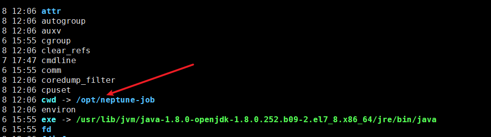

# Linux

### Linux基本命令

- hostname:  查看当前系统的主机名
- whoami: 查看当前登录用户的
- ip a: 查看虚拟机ip
- shutdown -h now:关机
- reboot: 重启
- pwd: 查看光标所在位置
- clear： 清屏
- ls 目录: 查看指定目录里面的文件或者文件夹
- touch 文件名： 创建一个指定的文件
- mkdir 目录名: 创建一个文件夹命令
- cd 目录： 进入指定的目录
- poweroff 关闭电源
- echo “字符串”将字符串输出到控制台上。
- tab键使用：在linux系统中可以有命令、目录、文件名补全的作用。
  - 若在一行上需要同时执行2条以上命令是用“；”分隔
- 查看命令帮助文档使用：
  - man 命令
  - 命令--help
  - 百度

> **linux系统中以点开头的文件或目录都是隐藏文件或目录**

### Linux目录结构

* /表示根目录，他下面有
  * <font color=red>**/root**    root用户的家目录</font>
  * <font color=red>**/home**   多个普通用户的家目录,相当于windowsC盘下的用户目录</font>
  * <font color=red>**/usr**    软件安装的目录（先编译放usr）</font>
    * 确切的是安装到了usr下的/local目录下
  * <font color=red>**/opt**    软件安装的目录（不需要编译放opt）</font>
  * <font color=red>**/tmp**    虚拟机重启时会丢失，放不重要的文件，临时文件</font>
  * <font color=red**/etc**    配置文件目录
  * /proc    Linux系统相关的内核相关的信息
  * /boot    引导程序所在目录
  * usr/bin      普通命令存放目录
  * usr/sbin     超级管理员命令存放目录
  * var      这个目录存放着不断扩展的东西，一般将经常修改的东西存在这个目录，如日志

### 绝对路径和相对路径	

* 绝对路径：以/开头的表示绝对路径
  * 例：cd /user
* 相对路径：目标目录相对于当前目录的路径（就是以当前所在的目录为目标，../代表返回上一层目录）
  * 例：cd .../user

> **cd ~**     回到当前用户目录下

### Vi编辑器

* :q   不保存退出
* :q!   不保存强制退出
* :wq  保存退出
* :wq!  强制保存退出

### 快捷键

#### 一般模式下


#### 末行模式下

* 进入末行模式使用esc+：号


**这里的替换是将old替换为new**

### 常用增删改查


### 一些其他重要的命令

* echo "文本"
  * 将文本打印到控制台
* echo "文本" > 文件名
  * 将文本覆盖掉文件里面的内容
* echo "文本" >> 文件名
  * 将文本追加到文件里面
* free -m     查看内存
* df -h         查看硬盘整体的使用情况：-h 表示以兆显示
* du           查看某个目录下的文件大小
  * du  -sm/*       检查根目录下每个目录所占用的容量
* find / -name "*da*" 在根目录下查找文件名含有da的文件或者文件夹
* sync 关机之前，最好将内存中的数保存到磁盘上！
* file 文件     查看文件类型
* yum -y install 软件名安装软件
* grep 查找文本中的内容
  * | 管道符 通常跟grep一起使用
* cat aa.txt | grep "hello" 查看aa.txt文件中是否含有内容hello
* history 查看历史命令
* ps –ef | grep redis   查看某个服务是否启动(==包含父进程==)
* ps -aux |  grep redis    查看某个服务是否启动(==不包含父进程，使用的多==)
* pstree -pu    以树形状的方式展示进程
  * p  显示父ID
  * u 显示用户组
* netstat -antp | grep 端口号
* kill -9 pid 杀死某个进程
* date 查看系统当前日期
  * date +%Y-%m-%d   显示年月日
  * date +%Y-%m-%d' '%H:%M:%S   显示年月日时分秒
*  date -s 设置系统当前时间
  * date -s '2008-05-23 01:01:01'
* ntpdate [ntp ip/hostname] 同步时间
  * 常用作部署集群的时候使用
* whereis   服务名 
  * 查看服务的所在位置

### 文件的基本属性


- ==**第一个字母表示文件的类型**==
  - d 表示这是一个目录
  - \- 表示这是一个文件
  - l 表示这是一个链接文档  **即tmp代表/var/tmp**
- ==**后面每三个字母是一组，第一组表示属主即文件的主人，第二组属组即你所在的组，第三组是其他用户**==
  - w 写权限
  - r  读权限
  - x 执行权限
  - \- 表示占位
- ==**后面紧跟的是属主、属组(即属主是root用户，属组是root组)**==

### 软连接和硬链接(拓展)

- **硬链接：**相当于复制了一份，假设B是A的硬链接，把A删除通过B照样可以访问

- **软连接：**相当于windows中的快捷方式，把A删除，通过B不能够访问到文件

- 硬链接创建方式：ln  源文件   新文件

- 软连接创建方式：ln -s 源文件  新文件

  ```bash
  [root@bank home]# touch f1   						#创建f1文件
  [root@bank home]# ln f1 f2							#创建硬链接
  [root@bank home]# ln -s f1 f3  						#创建软链接
  [root@bank home]# ll
  -rw-r--r-- 2 root  root   0 8月  16 14:16 f1
  -rw-r--r-- 2 root  root   0 8月  16 14:16 f2		   #硬链接
  lrwxrwxrwx 1 root  root   2 8月  16 14:17 f3 -> f1  #软连接
  ```

> 当 f1 发生改变时 f2 和 f3 都会发生改变，当 f1删除时，f2 还会存在，f3 会消失
>
> 可以使用硬链接来做备份

### 用户和用户组信息

添加用户useradd  用户名

* 添加用户后要立刻给用户添加密码，使用passwd  用户名

- userdel [-r]  用户名  # -r表示清空用户目录可选择

- usermod -L 用户名，   将用户锁上

- usermod -U 用户名，   解锁用户

- last   查看所有登录用户记录

-------------------------------------------------------

- groupadd  用户组名      添加用户组信息

- useradd -g    组名   用户名       创建用户时指定用户初始组

- groupdel   用户组名    删除用户组信息

- usermod -g 组名   用户名      修改用户到那个组

- groups 用户名   查看用户所在的组

---------------------------

- 更改文件权限： chmod \[ugoa][+-=][rwx] \文件名 : u(属主)/g(属组)/o(其它人)/a(所有人)，其中ugoa时任选其一

- 更改文件权限：chmod 777 文件或目录(**常用**)

- 更改文件所有者： chown 要更改的所属用户 文件名

- 更改文件所属组： chgrp 要更改的所属组名 文件名

- 同时更改所有者和所属组： chown   要更改的所属用户:要更改的所属组名  文件名


### 解压缩


### 三种安装方式

* **rpm包安装**
  * 查询：
    * rpm -qa:查询所安装的所有rpm软件包
    * rpm -q tomcat   查询单个
    * rpm -qa | grep 要查询的名称    使用管道过滤查询
  * 安装：
    * rpm -ivh  RPM包全路径名称     （i=install,安装   v=verbose,提示信息    h=hash,进度）
  * 卸载： 
    * rpm -e RPM软件包（这里是安装后的包名）

* rpm的局限性，在安装有依赖的软件时，要先安装依赖的软件（也就是安装有关联的软件时要先安装关联的软件）
* ==会自动配置环境变量==

* **yum install 软件名**
  * 安装:
    * yum -y install 包名：自动选择y，全自动
    * yum install 包名：手动选择y or n
  * 删除：
    * yum remove 包名
  * 能够避免安装时依赖的问题
  * 需要有网络
* **解压配置安装**
  * 压缩tar.gz的内容      tar -zcvf  要压缩的文件夹   要压缩的文件1  要压缩的文件2....
  * 解压：
    * 解压tar.gz的内容tar -zxvf 要解压的文件名             默认解压到当前文件夹
    * 解压到指定目录tar -zxvf 要解压的文件名   -C   /要解压到的路径

### 配环境变量:

* vim /etc/profile

  * JAVA环境变量：

    * export JAVA_HOME=/opt/install/jdk1.8.0_161
      export PATH=$PATH:$JAVA_HOME/bin

      export CLASSPATH=.:$JAVA_HOME/jre/lib/rt.jar:$JAVA_HOME/lib/dt.jar:$JAVA_HOME/lib/tools.jar

  * TOMCAT环境变量：

    * export CATALINA_HOME=/opt/install/tomcat8.5
      export PATH=$PATH:$CATALINA_HOME/bin

* 修改完文件后执行重新加载一下文件：source /etc/profile

### 防火墙

* 查看防火墙的状态
  * systemctl status firewalld
* 关闭防火墙
  * systemctl stop firewalld
* 启动防火墙
  * systemctl start firewalld
* 设置开机禁用防火墙
  * systemctl disable firewalld
* 开启防火墙端口
  * firewall-cmd **--zone=public(加粗可省略)** --add-port=9200/tcp --permanent   （一般修改后需要重新加载配置）
* 查看默认防火墙状态（关闭后显示notrunning，开启后显示running）：
  * firewall-cmd --state
* 重新加载配置
  * firewall-cmd --reload
* 查看开放的端口
  * firewall-cmd --list-ports

### 压力测试

* 安装工具：yum -y install httpd-tools
* ab -n 输入要测试的条数 -c 一次性发送多少条 http://要测试的ip

```txt
Concurrency Level: 50
//并发请求数
Time taken for tests: 7.417 seconds
//整个测试持续的时间
Complete requests: 1000
//完成的请求数
Failed requests: 0
//失败的请求数
Total transferred: 1234000 bytes
//整个场景中的网络传输量
HTML transferred: 951000 bytes
//整个场景中的HTML内容传输量
```

### Shell 脚本

> **都以 #!/bin/bash或#!/bin/sh开头**，**shell脚本文件都以.sh结尾**

**执行的两种方式：**

* sh 脚本名称:这种执行脚本的方式不需要当前用户有该文件的执行权限。
* ./脚本名称：直接执行当前目录下的某个脚本,要求：当前用户有该文件的可执行权限

#### echo(输出语句)

```bash
#!/bin/bash
echo "Hello World !"
```

#### 注释

```bash
单行注释   #注释内容
多行注释(EOF 也可以使用其他符号)：
方式一：
	:<<EOF
    注释内容...
    注释内容...
    注释内容...
    EOF
方式二：
	:<<'
    注释内容...
    注释内容...
    注释内容...
    '
方式三：
	:<<!
    注释内容...
    注释内容...
    注释内容...
    !

```

#### 变量

> 命名规范和Java一样
>
> - **1) 局部变量** 局部变量在脚本或命令中定义，仅在当前shell实例中有效，其他shell启动的程序不能访问局部变量。
> - **2) 环境变量** 所有的程序，包括shell启动的程序，都能访问环境变量，有些程序需要环境变量来保证其正常运行。必要的时候shell脚本也可以定义环境变量。
> - **3) shell变量** shell变量是由shell程序设置的特殊变量。shell变量中有一部分是环境变量，有一部分是局部变量，这些变量保证了shell的正常运行

使用变量时用`${变量名}`，或简写成`$变量名`

```bash
#!/bin/bash
my_name="honey bank"
echo ${my_name}
echo $my_name
```

**只读变量**

readonly  变量名

```bash
#!/bin/bash
my_name="honey bank"
readonly my_name
echo ${my_name}
my_name="hello bank"  #报错信息script.sh: line 5: my_name: readonly variable
```

**删除变量**

使用 unset  变量名 

```bash
#!/bin/bash
my_name="honey bank"
unset my_name
echo $my_name
```

#### 字符串操作

**单引号字符串的限制：**

- 单引号里的任何字符都会原样输出，单引号字符串中的变量是无效的；
- 单引号字串中不能出现单独一个的单引号（对单引号使用转义符后也不行），但可成对出现，作为字符串拼接使用

**双引号的优点：**

- 双引号里可以有变量
- 双引号里可以出现转义字符

```bash
#转义字符
your_name="runoob"
str="Hello, I know you are \"$your_name\"! \n"
echo -e $str  # -e 激活转义字符
```

```bash
#双引号读取变量
your_name="runoob"
# 使用双引号拼接
greeting="hello, ${your_name} !"
echo $greeting                           #hello, runoob !
# 使用单引号拼接 
greeting_1='hello, ${your_name} !'
echo $greeting_1                         #hello, ${your_name} !
```

 **获取字符串长度**

```bash
string="abcd"
echo ${#string} #输出 4
```

 **提取子字符串**

```bash
#从索引1开始提取4个子字符
string="runoob is a great site"
echo ${string:1:4} # 输出 unoo
```

 **查找子字符串**

```bash
#查找i或者o首次出现在第几个字符，如果没有则输出0
string="hello world"
echo `expr index "$string" io`  # 输出 5
```

#### 数组

**定义**：`array_name=(value0 value1 value2 value3)`

**数组某个值的读取**：`${数组名[下标]}`

> **\*或者@ 能够获取数组中所有的数据**

```bash
#定义数组
nums=(29 100 13 8 91 44)
echo ${nums[@]}  #输出所有数组元素
nums[10]=66  #给第10个元素赋值（此时会增加数组长度）
echo ${nums[*]}  #输出所有数组元素
echo ${nums[4]}  #输出第4个元素
```

**获取数组的长度**

```bash
nums=(29 100 13 8 91 44 55)
length=${#nums[@]}   # 取得数组元素的个数
echo $length
length=${#nums[*]}   # 取得数组元素的个数
echo $length
lengthn=${#nums[2]}  # 取得数组单个元素的长度
echo $lengthn
```

#### 参数传递

> **$n**。**n** 代表一个数字，1 为执行脚本的第一个参数，2 为执行脚本的第二个参数，以此类推……

测试：

```bash
1、创建脚本
	#!/bin/bash
    echo "Shell 传递参数实例！";
    echo "执行的文件名：$0";
    echo "第一个参数为：$1";
    echo "第二个参数为：$2";
    echo "第三个参数为：$3";
2、chmod 755 脚本文件    #赋予这个脚本的执行权限
3、./test.sh 1 2 3      #执行脚本传递命令
```

**其他几种参数处理：**

| 参数处理 | 说明                                                         |
| -------- | ------------------------------------------------------------ |
| $#       | 传递到脚本的参数个数                                         |
| $*       | 以一个单字符串显示所有向脚本传递的参数。 如"$*"用「"」括起来的情况、以"$1 $2 … $n"的形式输出所有参数。 |
| $$       | 脚本运行的当前进程ID号                                       |
| $!       | 后台运行的最后一个进程的ID号                                 |
| $@       | 与$*相同，但是使用时加引号，并在引号中返回每个参数。 如"$@"用「"」括起来的情况、以"$1" "$2" … "$n" 的形式输出所有参数。 |
| $-       | 显示Shell使用的当前选项，与[set命令](https://www.runoob.com/linux/linux-comm-set.html)功能相同。 |
| $?       | 显示最后命令的退出状态。0表示没有错误，其他任何值表明有错误。 |

示例二：

```bash
echo "Shell 传递参数实例"
echo "第一个参数为: $1"
echo "参数个数为：$#"
echo "将传递的参数以字符串形式显出$*"
./test.sh 1 2 3      #执行脚本传递命令
```

**$* 与 $@ 区别**：

- 相同点：都是引用所有参数。
- 不同点：只有在双引号中体现出来。假设在脚本运行时写了三个参数 1、2、3，，则 " * " 等价于 "1 2 3"（传递了一个参数），而 "@" 等价于 "1" "2" "3"（传递了三个参数）。

示例三：

```bash
#脚本
echo "-----\$*演示----"

for i in "$*";do
     echo $i
done


echo "------\$@演示---------"

for i in "$@";do
     echo $i
done

--------------------------------------------------------------------------------------------------------------------
结果：
	-----$*演示----
    1 2 3
    ------$@演示---------
    1
    2
    3

```

#### 基本运算符

原生bash不支持简单的数学运算，但是可以通过其他命令来实现，例如 awk 和 expr，expr 最常用。

expr 是一款表达式计算工具，使用它能完成表达式的求值操作。

例如，两个数相加(**注意使用的是反引号 <font color = red>` </font>而不是单引号 <font color = red>' </font>**)：

```bash
#!/bin/bash
val=`expr 2 + 2`
echo $val
```

**算术运算符**

| 运算符 |                     说明                      |
| :----: | :-------------------------------------------: |
|   +    |                     加法                      |
|   -    |                     减法                      |
|   *    |                     乘法                      |
|   /    |                     除法                      |
|   %    |                     取余                      |
|   =    |                     赋值                      |
|   ==   |   相等。用于比较两个数字，相同则返回 true。   |
|   !=   | 不相等。用于比较两个数字，不相同则返回 true。 |

**练习Demo**

```bash
#!/bin/bash
a=10
b=20

val=`expr $a + $b`
echo $val

val=`expr $a - $b`
echo $val

#乘号(*)前边必须加反斜杠(\)才能实现乘法运算
val=`expr $a \* $b`
echo $val

val=`expr $b / $a`
echo $val

val=`expr $b % $a`
echo $val

if [ $a == $b ]
then
	echo "等于"
fi

if [ $a != $b ]
then
   echo "a 不等于 b"
fi
```

**关系运算符**

| 运算符 |                         说明                          |
| :----: | :---------------------------------------------------: |
|  -eq   |          检测两个数是否相等，相等返回 true。          |
|  -ne   |        检测两个数是否不相等，不相等返回 true。        |
|  -gt   |   检测左边的数是否大于右边的，如果是，则返回 true。   |
|  -lt   |   检测左边的数是否小于右边的，如果是，则返回 true。   |
|  -ge   | 检测左边的数是否大于等于右边的，如果是，则返回 true。 |
|  -le   | 检测左边的数是否小于等于右边的，如果是，则返回 true。 |


**if 语句**

```shell
if [ 判断内容 ]; then
符合该条件执行的语句
fi
注意判断内容前后都有空格
```

**if…else 语句**

```shell
if [ 判断内容 ];then
符合该条件执行的语句
elif [ 判断内容 ];then
符合该条件执行的语句
else
符合该条件执行的语句
fi
```

**案例：**

```shell
if [ $1 = 'zhangsan' ] ; then
echo "welcome zhangsan"
elif [ $1 = 'lisi' ] ; then
echo "welcome lisi"
else
echo "welcome you"
fi
$1代表执行语句后面跟的参数，$0时shell文件自身的名字  如：./shell脚本文件名称  参数
```

**for 语句：**

```shell
for(( i =0;i<10;i++))
#do代表开始执行
do
循环语句;
#done代表结束
done
```

for案例：

```shell
#!/bin/bash
for (( i=0;i<10;i++))
do
echo "this is the $i time"
done
```

### 扩展

#### 在本机访问一个地址

- `curl`   http://localhost:8080
- `cat 文件名`  查看文件，顺序查看
- `tac 文件名`  查看文件，倒叙查看
- `nl  文件名`   显示行号查看文件

#### 环境变量目录

- 配置环境变量都在 `/etc/profile`中配置

#### 后台运行

- 运行的时候添加`nohup`参数

#### linux端口和进程Id的查询

> 如果没有netstat命令，使用 yum -y install net-tools安装

- 根据服务名查询进程ID和端口
  - ps -ef | grep tomcat

- **根据进程id查询端口**
  - netstat -nap | grep 进程ID

- **根据端口查进程id**
  - netstat -tunlp | grep 端口
- **根据进程id查看进程信息**
  - ps -ef | grep 进程ID

**Windows查看端口和进程**

```bash
# window 查看占用端口80
netstat -aon|findstr "80"

# 查询进程号2448信息
tasklist|findstr "2448"

# 可以在任务管理器查询进程号并杀死
```

#### Linux下找到运行jar包所在的目录

1. ps  -aux   | grep  java(或jar包名称)    找到进程ID
2. 在proc目录下会有每个进程id对应的目录      cd   /proc/进程ID的目录
3. 找到cwd 对应的路径就是jar包的路径



#### 其他一些基本常用命令

- 查看8080端口占用情况
  - netstat -tln | grep 8080
- 查看端口属于哪个程序
  - lsof -i :8080
- 查看demo.txt文件头10行
  - head -n 10 demo.txt
- 查看demo.txt文件尾10行
  - tail -n 10 demo.txt
- 如何查找一个文件大小超过5M的文件
  - find . -type f -size +5M
- 如果知道一个文件名称，怎么查这个文件在[linux](https://so.csdn.net/so/search?from=pc_blog_highlight&q=linux)下的哪个目录，如：要查找demo.txt文件
  - find / -name demo.txt
- 在文件中查找字符串(不区分大小写)
  - grep -i "chenhaha" demo.txt
- 在多级目录中对文本进行递归搜索
  - grep "text" /usr/local/ -r -n
- 打印 /etc/ssh/sshd_config 的第一百行？
  - sed -n '100p' /etc/ssh/sshd_config
- ping 一个远程主机，只发 5 个数据包
  - ping -c 5 192.168.101.9

#### 内存使用查询

**查询内存命令free**

> Mem：表示物理内存统计
>
> Swap：表示硬盘上交换分区的使用情况
>
> total：表示 总计物理内存的大小。
>
> used：表示 已使用多少。
>
> free：表示 可用内存多少。
>
> Shared：表示多个进程共享的内存总额。
>
> Buffers/cached：表示 磁盘缓存的大小。

1. free -b：以bytes为单位来显示内存的信息。
2. free -k：以kb为单位来显示内存的信息。
3. free -m：以m为单位来显示内存的信息。
4. free -g：以G为单位来显示内存的信息。
5. free -h：以适于人类可读方式显示内存信息。-h与其他命令最大不同是**-h**选项会在数字后面加上适于人类可读的单位
6. free -l：显示高低内存的利用率。
7. free -t：显示linux的全部内存。