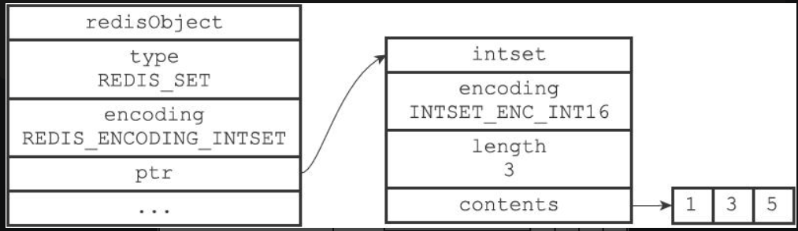
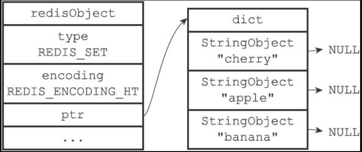
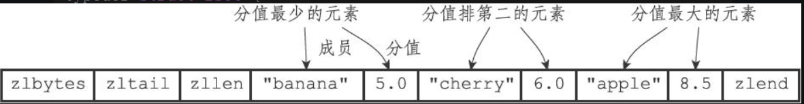
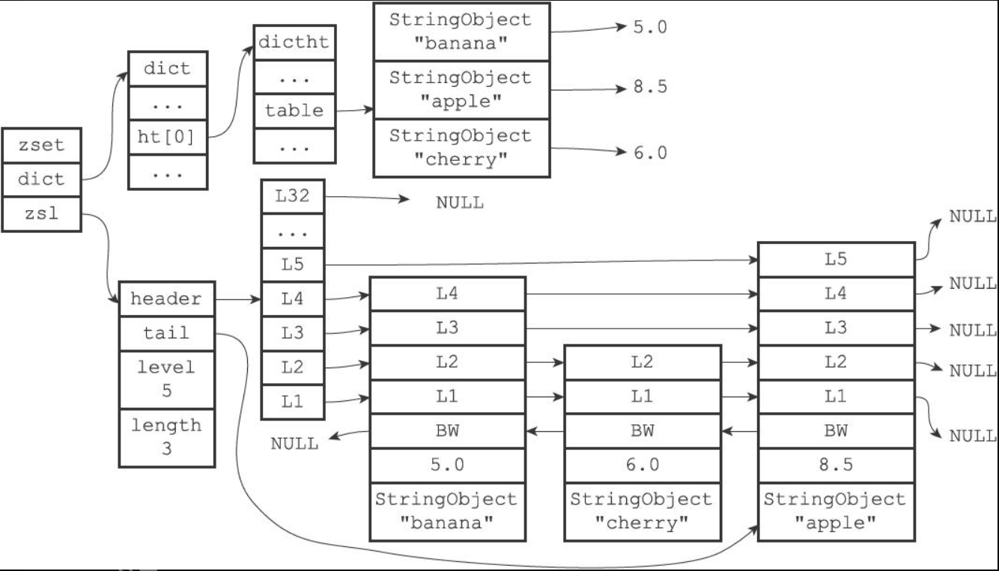

# Redis

### 简介：

Redis：全称: Remote Dictionary Service:远程字典服务, Redis是一个开源的使用ANSI C语言编写、支
持网络、可基于内存亦可持久化的日志型、Key-Value数据库[NoSQL]，并提供多种语言的API。实际开发中，
主要时用来做缓存，加快查询效率。

参考文档： http://redisdoc.com/index.html

### Sql和No Sql区别

> **关系型数据库是可以执行sql语句的，非关系型数据库（NO Sql）是不能执行sql的**

|        功能        |            SQL            |          NO SQL          |
| :----------------: | :-----------------------: | :----------------------: |
|     常用数据库     | Mysql、Oracle、SQL server |            否            |
|   是否结构化数据   |            是             |            否            |
|    是否支持SQL     |            是             |            否            |
| 是否支持服务端脚本 |            是             |       支持lua脚本        |
|    是否支持分片    |            是             |            否            |
|    是否支持事务    |      是（基于ACID）       |      是（基于CAP）       |
|      访问控制      |    粒度的用户访问权限     | 简单的基于密码的访问控制 |
|    是否支持外键    |            是             |            否            |
|    是否支持索引    |            是             |            否            |

> **数据库的四大特性（ACID）：**
>
> **1.原子性（Atomicity）**
>
> 　　原子性是指事务包含的**所有操作要么全部成功，要么全部失败回滚**。失败回滚的操作事务，将不能对事务有任何影响。
>
> **2. 一致性（Consistency）**
>
> 　　一致性是指事务必须使数据库从一个**一致性状态**变换到另一个一致性状态，也就是说一个事务执行之前和执行之后都必须处于一致性状态。
>
> 　　例如：A和B进行转账操作，A有200块钱，B有300块钱；当A转了100块钱给B之后，他们2个人的总额还是500块钱，不会改变。
>
> **3. 隔离性（Isolation）**
>
> 　　隔离性是指当多个用户并发访问数据库时，比如**同时访问一张表**，数据库每一个用户开启的事务，不能被其他事务所做的操作干扰(也就是事务之间的隔离)，多个并发事务之间，应当相互隔离。
> 　　例如：同时有T1和T2两个并发事务，从T1角度来看，T2要不在T1执行之前就已经结束，要么在T1执行完成后才开始。将多个事务隔离开，每个事务都不能访问到其他事务操作过程中的状态；就好比上锁操作，只有一个事务做完了，另外一个事务才能执行。
>
> **4. 持久性（Durability）**
>
> 　　持久性是指事务的操作，一旦提交，对于数据库中数据的改变是永久性的，即使数据库发生故障也不能丢失已提交事务所完成的改变。

-----------------------------

> **NO SQL的ACP：**
>
> - 一致性（**C**onsistency）
> - 可用性（**A**vailability）
> - 分区容错性（**P**artition tolerance）
>
> **分区容错性**：指的分布式系统中的某个节点或者网络分区出现了故障的时候，整个系统仍然能对外提供满足一致性和可用性的服务。**也就是说部分故障不影响整体使用。**
>
> 事实上我们在设计分布式系统是都会考虑到bug,硬件，网络等各种原因造成的故障，所以即使部分节点或者网络出现故障，我们要求整个系统还是要继续使用的
>
> (不继续使用,相当于只有一个分区,那么也就没有后续的一致性和可用性了)
>
> 
>
> **可用性：** **一直可以正常的做读写操作**。简单而言就是客户端一直可以正常访问并得到系统的正常响应。用户角度来看就是不会出现系统操作失败或者访问超时等问题。
>
>  
>
> **一致性**：在分布式系统完成某写操作后任何读操作，都应该获取到该写操作写入的那个最新的值。**相当于要求分布式系统中的各节点时时刻刻保持数据的一致性**。
>
> **三种不能同时满足（很难做到），我们一般都选择其中的两种，CA或AP**

* **Redis不适用场景：**
  1. 取代通过键也就是key查询，而是通过值value来查询[条件查询]，如关系型数据库就是通过值来查询的。Key-Value 数据库中根本没有通过值查询的途径
  2. 需要储存数据之间的关系。在Key-Value 数据库中不能通过两个或以上的键来关联数据。（带有外键的不行）
  3. 事务的支持。在Key-Value 数据库中故障产生时不可以进行回滚。（NO SQL不支持回滚）
* **Redis适用的场景：**
  1. 储存用户信息，比如会话、参数、购物车等等。
  2. 这些信息一般都和ID（键）挂钩,这种情景下键值数据库是个很好的选择
  3. 对数据高并发的读写
  4. 海量数据的读写
  5. 对数据高可扩展性的

* 总结:
  * Key-value数据库就像在传统语言中使用的哈希表。
  * 可以通过key 来添加、查询或者删除数据，鉴于使用主键访问，所以会获得不错的性能及扩展性。

### Redis vs Memcached的比较

|   对比项   |          redis          |       memcached       |
| :--------: | :---------------------: | :-------------------: |
| 网络IO模型 | 单核（线程）+多路IO复用 |    多核（线程）+锁    |
|  数据类型  |          多种           | 仅支持简单的key-value |
|  虚拟内存  |          支持           |        不支持         |
| 数据持久化 |          支持           |        不支持         |
|  主从复制  |          支持           |        不支持         |
|    集群    |       服务端集群        |      客户端集群       |
|    事务    |          支持           |        不支持         |
|   流行度   |        非常流行         |       下滑严重        |

* **三种NO SQL的应用场景**
  * Redis 最佳应用场景：适用于数据变化快【高频修改】且数据库大小可遇见（适合内存容量）的应用程序。
  * Memcache 最佳应用场景:适于存储的数据结构简单(仅k/v)，提升性能;做缓存，提高性能（适合读多写少）
  * MongoDB:解决海量数据访问效率问题,特点：面向文档，适合修改少，读取多的场景，支持丰富的查询语言。

### redis具体应用场景


> **上面五种常用，下面三种不常用。**
>
> **string是用的最多的**
>
> **list是有序可重复的**
>
> **set是无序不可重复的**
>
> **上面说的几种类型都是value的类型，key都是string类型的**

### redis数据类型

**几种类型都是value的类型，key都是string类型的**

* 五种基本类型
  * 字符串类型（string）
  * 哈希（hash）
  * 字符串列表（list）
  * 字符串集合（set）
  * 有序字符串集合（sorted set）
* 三种特殊类型（不常用）
  * bitmaps（统计基数，就是不重复的数的个数）
  * hyperloglogs
  * geospatial      地理空间

### redis key的说明

* 关于key 的定义需要注意以下几点：
  1. key 不要太长，最好不要超过1024 个字节，太长消耗内存降低查询效率,最大的key 允许512MB
  2. key 不要太短,太短降低key 的可读性
  3. 在项目中key 最好有一个统一的命名规范,多个单词之间用:分隔，如:user:100::id​   （这里是100）
  4. redis 中的命令语句中，命令是忽略大小写的，而key 是不忽略大小写的。
* key的作用
  * Key在Redis 实际使用过程中更多的用作缓存，然而缓存的数据一般都是要设置生存时间的，即到期后数据销毁

### redis几个简单的常用命令

* EXPIRE key seconds 设置key的生存时间（单位：秒）key在多少秒后会自动删除
* TTL key 查看key剩余的生存时间
* PERSIST key 清除生存时间
* PEXPIRE key milliseconds 生存时间设置单位为：毫秒

> 注意：ttl 如果返回值为正数，表示key 剩余的生存时间为该时间，
> 如果为-1 表示永久不过期
> 如果为-2 表示是不存在的key!

* keys *      查看当前库所有key
* exists key     判断某个key是否存在
* type key      通过key查看value是什么类型
* del key        删除指定的key数据

* 库的切换与操作
  * select 命令切换数据库   select  库的索引（默认是0-15)
  * dbsize 查看当前数据库的key的数量
  * flushdb 清空当前库
  * flushall 通杀全部库
  * move  key  要移到库的索引     将一个库的某个key值移到别的库

### String类型

> 底层使用SDS(Simple Dynamic Strings)结构，他由三部分组成，长度、剩余空间、字节数组(保存数据)，他总是以\0结尾，保留了C语言中的特性。
>
> 它由三种编码格式：
>
> 1. int：存储数字
> 2. embstr：存储长度小于32个字节的字符串
> 3. raw：存储长字符串

* **赋值命令**
  * SET key value
  * 例：set test 123   （这里key是test，value是123）
* **取值命令**
  * GET key
  * 例：get test
* **设置多个键值**
  * MSET key1 value1 key2 value2....
  * 例：mset k1 ·v1 k2 v2 k3 v3
* **获取多个键值**
  * MGET key1 key2...
  * 例：mget k1 k2 k3
* **取值并赋值**
  * GETSET key value   这里是先将值取出来，然后在改变这个值
  * 例：getset k1 v10    k1的值取出来改成v10
* **删除**
  * DEL key     【成功为1，不成功为0】
  * 例：del k1
* **数值增减**
  * 语法：incr key
  * 作用：让当前键值递增，并返回递增后的值
  * 如果该key 不存在，其初始值为0，在执行完incr 之后其值为1，
  * 如果value 的值不能转换成整形,如hello，该操作将执行失败并返回相应的错误信息。
* **增加指定的整数**
  * 语法：incrby key increment
  * 作用：给某个key 对应的值增加指定的幅度。
  * 例：incrby  key  要增加的数值
* **递减数值**
  * 语法：decr key
  * 作用：使得该key 对应的某个值减一
  * 如果该key 不存在，其初始值为0，在执行完decr 之后其值为-1
  * 如果value 的值不能转换成整形，如hello，该操作将执行失败并返回相应的错误信息。
* **减少指定的整数**
  * 语法：DECRBY key decrement
  * 作用：将某个key 对应的值减去指定的值。
  * 例：DECRBY key   要减去的数值
* **拼凑字符串**
  * APPEND key value
  * 例：append test world    为test这个key拼接world

### Hash 类型

> 底层数据结构使用的是ziplist(压缩列表)或者hashtable(字典)
>
> 压缩列表情况：会先将key推到压缩列表头部紧跟着将value推到头部第二个位置，保证每个key和value都是紧密相连的，**添加数据是从尾往头推的方式**
>
> 字典：
>
> - 字典的每个键都是一个字符串对象，对象中保存了键值对的键
> - 字典的每个值都是一个字符串对象，对象中保存了键值对的值
>
> 
>
> **使用压缩列表前提**：
>
> 1. 哈希对象保存的所有键值对的键和值的字符串长度都小于64字节；
> 2. 哈希对象保存的键值对数量小于512个；不能满足这两个条件的哈希对象需要使用hashtable编码。

Redis 中的Hash 类型可以看成具有String Key 和String Value 的map 容器。所以该类型非常适合于存储值对象|表的信息。如Username、Password 和Age 等。如果Hash 中包含很少的字段，那么该类型的数据也将仅占用很少的磁盘空间。每一个Hash 可以存储4294967295（2^32 -1）个键值对。


**适合存储对象或者数据表的数据,而且对象中的属性或者表中的列是无序的。**

* **赋值**        HSET 命令不区分插入和更新操作，当执行插入操作时HSET 命令返回1，当执行更新操作时返回0。
  * 语法：HSET key field value  （field可以看成对象属性）
  * 作用：设置给某个key 的某个field 一个字段值
  * 例：hset user username zhangsan        给user这个key的username赋值为zhangsan
* **一次赋值多个字段**
  * HMSET key  field1  value1  field2  value2...
  * 例：hmset user age 20 username lisi
* **取值**
  * 语法：HGET key field
  * 作用：一次只能获取一个字段值
  * 例：hget user username       获取user这个key的值
* **一次取值多个字段**
  * 语法：HMGET key field1  field2
    作用：一次可以获取多个字段值
  * 例：hmget user age username
* **获取所有字段和值**
  * 例：127.0.0.1:6379> hgetall user
    1) "age"
    2) "20"
    3) "username"
    4) "lisi"
* **当字段不存在时赋值**
  * 语法：HSETNX key field value
  * 作用：当字段不存在时赋值，类似HSET，区别在于如果字段存在，该命令不执行任何操作
  * 例：hsetnx user age 30 如果user中没有age字段则设置age值为30，否则不做任何操作 
* **获得所有的字段**
  * HKEYS key
  * 例：127.0.0.1:6379> hkeys user
    1）"age"
    2) "username"
* **获得所有的value**
  * HVALS key
  * 例：127.0.0.1:6379> hvals user
    1）"20"
    2) "sunny"
* **删除**
  * 语法:HDEL key field1  field2...
    作用:删除一个或多个字段，返回值是被删除的字段个数
* **删除整个HASH**
  * DEL key
* **增加或减去数字（如果是减去的话就加负值）**
  * hincrby key field 要增加的数字
  * 例：hincrby user age 2   给user这个key的age加2
* **判断key中的field是否存在**
  * 语法：hexists key field     
  * 作用：判断指定的key 中的filed 是否存在，存在返回1，不存在返回0
* **获取key 所包含的field 的数量**
  * hlen key

### List 类型

> 底层由ziplist(压缩列表)或linkedlist(双端链表)实现，数据量少的时候使用压缩列表，这样更节省内存效率更高，数据量大的时候使用双端链表，双端链表中每个node存储的是String对象(详细见上文String说明)
>
> 压缩列表转为双端列表条件：
>
> 1、列表对象保存的所有字符串元素的长度都小于64字节  
>
> 2、列表对象保存的元素数量小于512个
>
> **注意**：在redis3.2之后使用quicklist，我们仍然可以吧quicklis看作双向链表但每个节点都是一个ziplist(压缩列表)

List 类似于java 中的列表类型，里面的数据：有序、可重复，而且List 是双向链表，其组织结构如下：


**这里的value1、value2、value3 顺序实际上反了，从左边先推进去的，实际上出现在最右边！**

- **向列表两端增加元素(L代表left从左边推入，先推入的在最右边，同理right是向右边推入，先推入的在最左边)**
  - LPUSH key1 value1 key2 value2...
  - RPUSH key1 value1 key2 value2...
  - 例：lpush list 1 2 3 
    - rpush list 4 5 6
    - 结果：为321456
- **查看列表（查询0  -1是查询全部）**
  - LRANGE key start stop    start待变开始索引   stop代表结束索引
    - 查询lpush索引从0开始
    - 
    - 查询rpush索引从   -插入的个数   -1
    - 
  - 

* **从列表两端弹出元素**
  * 作用:L(R)POP 命令从列表左|右边弹出一个元素，会分两步完成
    * 第一步是将列表左边的元素从列表中移除
    * 第二步是返回被移除的元素值
  * LPOP key  从左边弹出
  * RPOP key   从右边弹出

> **lpop和rpop可以模拟数据结构中的队列和栈的结构**

* **获取列表中元素的个数**
  * LLEN key

### Set

> 底层使用intset(整数集合)或hashtable(字典)
>
> 整数集合：使用整数集合
>
> 
>
> 字典：字典的每个键都是一个字符串对象，每个字符串对象包含了一个集合元素，而字典的值则全部被设置为NULL
>
> 
>
> **使用整数集合的情况：**
>
> 1. 所有元素都是整数
> 2. 元素个数不超过512个，不能满足这两个条件的集合对象需要使用hashtable编码

在Redis 中，我们可以将Set 类型看作为没有排序的字符集合，和List 类型一样，我们也可以在该类型的数据值上执行添加、删除或判断某一元素是否存在等操作。需要说明的是，这些操作的时间是常量时间。Set 可包含的最大元素数是4294967295[2^32 -1]。和List 类型不同的是，Set 集合中不允许出现重复的元素。和List 类型相比，Set 类型在功能上还存在着一个非常重要的特性，即在服务器端完成多个Sets 之间的聚合计算操作，如unions、intersections 和differences。由于这些操作均在服务端完成，因此效率极高，而且也节省了大量的网络IO 开销。

其结构为:


* **增加元素**
  * SADD key 元素1  元素2...
  * 例：sadd set a b c
* **删除元素**
  * 语法:SREM key 元素1  元素2...   （rem代表remove）
    作用: 删除集合SET 中的元素
  * 例：srem set b
* **获得集合中的所有元素**
  * 语法：SMEMBERS key
  * 例：

* **判断元素是否在集合中**
  * 语法：SISMEMBER key 元素
  * (integer) 1  为true    (integer) 0  为false
* **集合差集运算** 
  * SDIFF key1 key2
  * SDIFF key1 key2 就是把key1 跟key2相比输出key1里面有key2里面没有的
  * 例：

```redis
127.0.0.1:6379> sadd mya1 a b c
(integer) 3
127.0.0.1:6379> sadd myb1 a c 1 2
(integer) 4
127.0.0.1:6379>sdiff mya1 myb1
1) “b”
```

* **集合交集运算**
  * 语法：SINTER key1 key2 .....
  * SINTER key1 key2    key1和key2都有的，共有的
  * 例：

```redis
127.0.0.1:6379> sadd mya2 a b c
(integer) 3
127.0.0.1:6379> sadd myb2 a c 1 2
(integer) 4
127.0.0.1:6379>sinter mya2 myb2
1)“c”
2)“a”
```

* **集合并集运算**
  * 语法：SUNION key1 key2 .....
  * 将所有key1里面有的，key里面有的加在一起（重复的不会合在一起）
  * 例：

```redis
192.168.22.132:6379> SADD mya3 a b c
(integer) 3
192.168.22.132:6379> SADD myb3 a c 1 2
(integer) 4
192.168.22.132:6379> SUNION mya3 myb3
1) "c"
2) "b"
3) "1"
4) "a"
5) "2"
```

* **获得set 成员数量**
  * 语法：SCARD key
* **随机返回set 中的一个成员**
  * 语法：SRANDMEMBER key

### Zset

> 底层是应用ziplist(压缩列表)或者skiplist(跳表)
>
> 压缩列表：每一个成员和他对应的分数紧密相连，从列表头部到尾部，以分数从小到大排列
>
> 
>
> 跳跃表：跳跃表里面保存了两个数据结构，字典和跳跃表，字典负责查询单个值的时候使用这样他的复杂度就是O(1)，跳跃表在使用排序的时候使用，使用两种方式进行存储大大调高了效率
>
> 

Sorted-Set 和Set 类型极为相似，它们都是字符串的集合，都不允许重复的成员出现在一个Set 中。它们之间的主要差别是Sorted-Sets 中的每一个成员都会有一个分数(score)与之关联，Redis 正是通过分数来为集合中的成员进行从小到大的排序。然而需要额外指出的是，尽管Sorted-Set 中的成员必须是唯一的，但是分数(score) 却是可以重复的。在Sorted-Set 中添加、删除或更新一个成员都是非常快速的操作，其时间复杂度为集合中成员数量的对数。由于Sorted-Set 中的成员在集合中的位置是有序的，因此，即便是访问位于集合中部的成员也仍然是非常高效的。事实上，Redis 所具有的这一特征在很多其它类型的数据库中是很难实现的，换句话说，在该点上要想达到和Redis 同样的高效，在其它数据库中进行建模是非常困难的。
例如：游戏排名、微博热点话题等使用场景。其结构如下所示：


* **增加元素**
  * 解释：向有序集合中加入一个元素和该元素的数值，如果该元素已经存在则会用新的数值替换原有的数值。返回
    值是新加入到集合中的元素个数，不包含之前已经存在的元素。
  * 语法：ZADD key 分数  成员1  分数  成员2...
  * 例：

```redis
127.0.0.1:6379> zadd scoreboard 80 zhangsan 89 lisi 94 wangwu
(integer) 3
127.0.0.1:6379> zadd scoreboard 97 lisi
(integer) 0
后续插入的李四分数将前面的覆盖
```

* **获取元素的数值**
  * 语法：ZSCORE key 成员
* **删除元素**
  * 语法：ZREM key 成员1 成员2...
  * 作用：移除有序集key 中的一个或多个成员，不存在的成员将被忽略
* **获取集合中元素个数**
  * 语法：zcard key
* **按顺序排列获取元素列表**
  * 语法：ZRANGE key start stop [WITHSCORES] 从小到大
  * 如果需要获得元素的数值的可以在命令尾部加上WITHSCORES 参数
  * 作用：按照元素数值从小到大的顺序返回索引从start 到stop 之间的所有元素（包含两端的元素）
    （说明：0 -1 返回全部, 注意：0，表示第一个元素，-1 表示最后一个元素）
  * 语法：ZREVRANGE key start stop  [WITHSCORES] 从大到小
  * 如果需要获得元素的数值的可以在命令尾部加上WITHSCORES 参数
  * 作用：按照元素数值从大到小的顺序返回索引从start 到stop 之间的所有元素（包含两端的元素）
  * 例：


* **获取集合中分数值在一定范围之间的元素**
  * 语法：zrangebyscore   key  分数1  分数2
  * 例：


* **给集合中的某个元素增加分值**
  * zincrby  key  要加的分数  要加分数的成员
  * 例


### 其他三种看课件或百度，不重要

### Redis 配置文件

**include 引入其他配置文件**


### Jedis在idea中链接redis客户端

1. 在pom.xml中添加jedis依赖
2. 在test方法或main方法中创建jedis对象（new）或创建连接池，new JedisPool（ip,端口号），再从连接池获取
3. 调用相应的方法（和Linux中的命令一样）
4. 关闭链接

### Redis 事务

Redis事务的主要作用就是串联多个命令防止别的命令插队，类似于批量执行指令的功能，所以redis中事务和mysql中的事务不是一回事。在redis中,MULTI/EXEC/DISCARD这三个命令是我们实现事务的基石。


redis三个命令的图解


当开启事务时在组队阶段 将值存储起来，当使用exec时统一发送 ，redis没有回滚

#### redis事务的两种错误

- 组队错误（命令输入错误）
  - 所有的数据都不会提交
- 执行错误
  - 只有错误本身不会提交，错误前后会提交数据

#### redis事务冲突的解决方案

* **悲观锁**
  * 每次拿数据都认为别人会修改，所以拿到数据后立马上一把锁，让其他请求拿不到数据，等他操作完在让其他人操作


* **乐观锁(使用watch对key进行监控)**
  * 每次拿都认为别人不会修改，不会上锁，但是拿到数据后会加一个版本号，其他请求过来时会修改，修改后会更改版号，当有多个人拿到这个数据时，谁先改完数据谁能修改版本号，其他人还保留原来的版本号，乐观锁适用于多读的应用类型，这样可以提高吞吐量。Redis 就是利用这种check-and-set 机制实现事务的


* **WATCH key**
  * 在执行multi 之前，先执行watch key1 [key2],可以监视一个(或多个) key ，如果在事务执行之前这个(或这
    些) key 被其他命令所改动，那么事务将被打断。

#### redis事务的三大特性

* 单独的隔离操作
  * 事务中的所有命令都会序列化、按顺序地执行。
  * 事务在执行的过程中，不会被其他客户端发送来的命令请求所打断。
* 没有隔离级别的概念
  * 队列中的命令没有提交之前都不会实际被执行，因为事务提交前任何指令都不会被实际执行
* 不保证原子性（也就是不保证同时成功或同时失败）
  * 事务中如果有一条命令执行失败，其后的命令仍然会被执行，没有回滚

### redis持久化（重点）

**介绍:**Redis 支持RDB 和AOF 两种持久化机制，持久化功能有效地避免因进程退出造成的数据丢失问题，当下次重启时利用之前持久化的文件即可实现数据恢复。

#### rdb持久化（以快照的方式，默认开启）

**介绍：**RDB 全称Redis DataBase:Redis 的数据库,在指定的时间间隔内将内存中的数据集生成快照保存到磁盘中，也就是行话讲的Snapshot 快照，它恢复时是将快照文件直接读到内存里。触发RDB 持久化过程分为手动触发和自动触发

* **机制**：在redis.conf配置文件中有一个dump.rdb文件默认保存在当前目录下，建议修改，让他保存在一个固定的目录下
* **手动触发**：使用save、bgsave、shutdown
  * **save工作原理**：阻塞当前redis服务器，直到rdb过程完成为止，同一时刻只处理一个请求


* **bgsave工作原理**：克隆一个子进程，子进程和父进程一摸一样，rdb持久过程由子进程负责，只在fork阶段进行阻塞，相当于异步，同一时刻可以处理多个请求	


* **save与bgsave对比：**


* **自动触发**：
  * 自动触发是由我们的配置文件来完成的。在redis.conf 配置文件中，里面有如下配置，我们可以去设置：

```redis
save m n: 表示m秒内数据集存在n次修改时,自动触发bgsave
案例：
save 900 1: 表示900 秒内如果至少有1 个key 的值变化,则保存
save 300 10: 表示300 秒内如果至少有10 个key 的值变化,则保存
save 60 10000: 表示60 秒内如果至少有10000 个key 的值变化,则保存
```

#### 几个常用的rdb 配置项

* stop-writes-on-bgsave-error
  * 当Redis 无法写入磁盘的话，直接关掉Redis 的写操作。推荐yes.
* rdbcompression
  * 对于存储到磁盘中的快照，可以设置是否进行压缩存储。如果是的话，redis 会采用LZF 算法进行压缩。
    如果你不想消耗CPU 来进行压缩的话，可以设置为关闭此功能。推荐yes.
* rdbchecksum
  * 默认值是yes。在存储快照后，我们还可以让redis 使用CRC64 算法来进行数据校验，但是这样做会增加大
    约10%的性能消耗，如果希望获取到最大的性能提升，可以关闭此功能。

#### rdb 备份及数据恢复

1. 备份: 将*.rdb的文件拷贝到别的地方【可以写定时脚本】
2. rdb的数据恢复
   1. 关闭Redis
   2. 先把备份的文件拷贝到工作目录下cp dump2.rdb dump.rdb
   3. 启动Redis, 备份数据会直接加载

#### aof持久化(将整条命令保存到文件中，默认不开启)

以日志的形式来记录每个写操作（增量保存），将Redis 执行过的所有写指令记录下来(读操作不记录)， 只许追加文件但不可以改写文件，redis 启动之初会读取该文件重新构建数据，换言之，redis 重启的话就根据日志文件的内容将写指令从前到后执行一次以完成数据的恢复工作。


* 当rdb和aof同时开启时，以aof为主

* **触发机制（自动触发，不对读（get）进行持久化）**：
  1. 方案一：每次执行一次写命令持久化
  2. 方案二：每秒持久化一次（默认）
  3. 方案三：从不同步

* **aof的重写原理**：达到一定条件会将重复代码进行优化（**两个要同时满足**）
  * 条件一：当前aof文件必须比上次aof文件大一倍（如上次aof是2兆，等达到4兆或以上）
  * 条件二：文件大小达到64mb

#### aof几个重写相关的配置

* no-appendfsync-on-rewrite：重写时是否可以运用appendfsync，用默认no 即可，保证数据安全性。
  * 例如：将复杂多个步骤操作的结果，采用简单一个步骤进行操作，减少aop 文件大小。
* auto-aof-rewrite-percentage：100
  * 设置重写的基准值，文件达到100%时开始重写（文件是原来重写后文件的2倍时触发）
* auto-aof-rewrite-min-size：64mb
  * 设置重写的基准值，最小文件64MB。达到这个值开始重写。

#### RDB 与AOF 对比

* 优先级：RDB 文件和AOF 文件同时存在的情况下,AOF 优先级要高一些
* 备份：RDB 快照是一次全量备份，AOF 增量备份，并且有重写机制


* **实际使用**

```txt
1.选择的话，两者加一起才更好,这也是官方推荐的使用方式。
2.因为两个持久化机制特点和自己的需求【需求不同选择的也不一定】,但通常都是结合使用
	2.1 如果对数据不敏感，可以选单独用RDB。
	2.2 不建议单独用AOF，因为可能会出现Bug。
	2.3 如果只是做纯内存缓存，可以都不用。
3.因为RDB文件只用作后备用途，建议只在Slave上持久化RDB文件，而且只要15分钟备份一次就够了，只保
留save 900 1 这条规则。
```

#### 备份及数据恢复

AOF 的备份机制和性能虽然和RDB 不同, 但是备份和恢复的操作同RDB 一样，都是拷贝备份文件，需要恢复时再拷贝到Redis 工作目录下，启动系统即加载。

* **正常恢复**
  *  修改默认的appendonly no，改为yes
  *  将有数据的aof 文件复制一份保存到对应目录(查看目录：config get dir)
  *  恢复：重启redis 然后重新加载
* **异常恢复**
  *  修改默认的appendonly no，改为yes
  *  如遇到AOF 文件损坏，通过/usr/local/bin/redis-check-aof --fix appendonly.aof 进行修复
  * 恢复：重启redis，然后重新加载

### 主从复制

**简介**：主机数据更新后根据配置和策略,自动同步到备机的master/slaver 机制，Master 以写为主，Slave 以读为主

**几条命令：**

* info replication 可以查看主从复制的相关信息（master时主机，slave时从机）
* slaveof或replicaof  主机ip  主机端口号   再从机上设置自己的主机
* slaveof no one    解除主从关联

**几个注意点：**

* 配从不配主
* 从节点只能读，不能写
* 从服务器不管是什么时候变成从服务器的，他都会从头将主服务器的数据进行复制
* 主服务器shutdown后，从服务器会原地待命
* 主服务器重新链接后，在添加数据，从服务器依然能够复制
* 从服务器宕机后，又从新链接，那么他就是一台新的服务器和原来的没有关系

**主从复制原理**：当成为从服务器时第一次直接将文件直接复制，以后只进行增量复制（只复制新添加的）

### 哨兵模式

**简介：**反客为主的自动版，实现主从自动切换，能够后台监控主机是否故障，如果故障了根据投票数自动将从库
转换为主库

选择条件：

1. 选择优先级靠前的（靠redis的配置文件里的priority，默认是100）
2. 选择偏移量大的（那个从节点从主节点复制的数据多）
3. 选择runid最小的从服务（通过nifo server查看，根据阿斯克吗一位一位进行比较）

### redis集群（重点）

主从复制只解决了读写的压力，没有解决并发写的问题和容量的压力，那么可以使用redis集群来解决

> **一般配置3主6从**

#### 配置集群的几条重要命令

* cluster-enabled yes #打开集群模式
* cluster-config-file nodes-7291.conf #设定集群节点配置文件名(集群信息会写到该文件中)
* cluster-node-timeout 5000 #设定节点失联时间，超过该时间（毫秒），集群自动进行主从切换
* redis-cli --cluster create 192.168.142.200:7291 192.168.142.200:7292 192.168.142.200:7293 192.168.142.200:7294 192.168.142.200:7295 192.168.142.200:7296 --cluster-replicas 1
  *  --cluster  create 代表创建一个集群，后面加ip和端口号
  * --cluster-replicas 1 集群副本设置为1，就是一个主节点有几个从节点

#### redis中有16384个槽（面试问）

数据具体存到槽中，每个槽可以存多条数据

#### 操作redis集群的几条命令

* 以前单节点的链接：redis-cli -p 端口号或redis-cli （默认本机6379）

* 集群方式：redis-cli -c -p 端口号
* set 同原始的一样，**注意：你设置的数据不一定在当前的redis服务器中，他会找他某个槽放入，并跳转到相应的服务器**

例：


* cluster nodes   列出集群当前已知的所有节点（node），以及这些节点的相关信息【主从信息】。
* cluster info       打印集群的信息
* redis-cli --cluster help    查看都有那些命令（其他命令，比如添加节点、删除节点，重新分布数据）
* rebalance   让各个节点的数据均衡

#### 故障修复

1. 如果主节点下线？从节点能否自动升为主节点
   - 可以
2. 主节点恢复后，主从关系会如何? 
   - 变为从节点
3. 如果所有某一段插槽的主从节点都当掉，redis服务是否还能继续?不能继续了。
   - 不能
   - 如果某一段插槽的主从都挂掉，而cluster-require-full-coverage 为yes ，那么,整个集群都挂掉
   - 如果某一段插槽的主从都挂掉，而cluster-require-full-coverage 为no ，那么，该插槽数据全都不能使
     用，也无法存储。（但是集群可以运行，数据是不全的）
   - redis.conf中的参数cluster-require-full-coverage , 16384个槽都正常的时候才能对外提供服务。

**几条补充：**

```txt
1. 一般情况下，一个集群最少有3个master节点
2. Redis集群的slot插槽有16384个
3. 在redis-cli进行查询、录入数据时，要使用集群的方式登录(-c),否则查询的数据如果不在对应服
务器的插槽时,会有redis报错问题。
4. 不在一个slot 下的键值，是不能使用mget、mset等多键操作的
5. 可以通过{}来定义组的概念，从而使key中{}内相同内容的键值对放到一个slot中去，一个slot槽中
的数据一定是在一个组中的。
例：
127.0.0.1:7291> set k1{book} v1
OK
127.0.0.1:7291> set k2{book} v2
OK
127.0.0.1:7291> set k3{book} v3
OK
```

