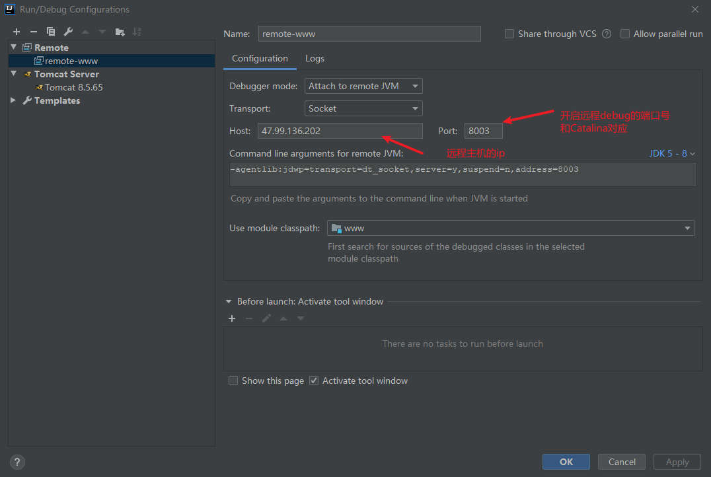
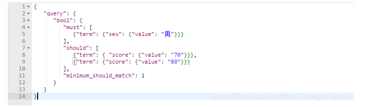
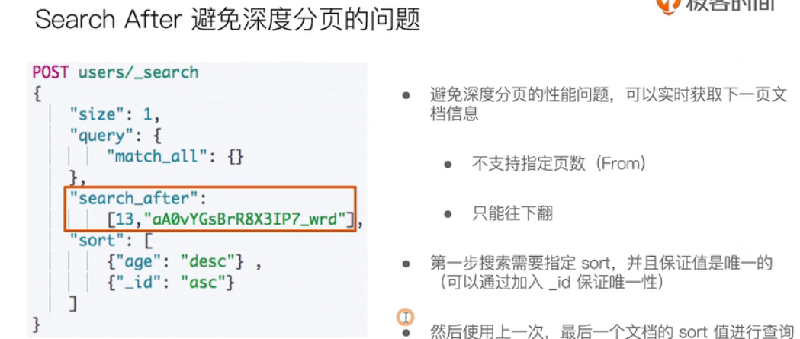
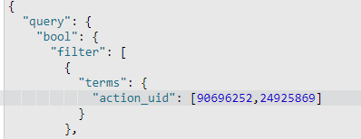
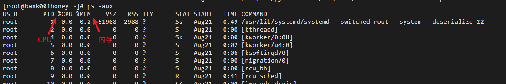

# 日常笔记

> 代码判空小技巧，如果出现了多个判空，将判空放在前面，不然容易报空指针

### Java知识大杂烩补充

#### 使用poi写多个文件到压缩文件

- <font color=red>ZipOutputStream解压缩文件输出流</font>

代码示例：

```java
@Controller
@RequestMapping("excel")
public class ExcelZipDownloadController {
    @RequestMapping("zip")
    public void excelZipDownload(HttpServletRequest request, HttpServletResponse response) throws Exception {
        Map<String, List<String>> listData = getListData();
        List<String> list1 = listData.get("list1");
        List<String> list2 = listData.get("list2");
        Workbook workbook = null;
        Workbook workbook2 = null;
        OutputStream os = null;
        ZipOutputStream zos = null;
        try {
            //创建工作簿
            workbook = new SXSSFWorkbook();
            workbook2 = new SXSSFWorkbook();
            //创建sheet
            Sheet sheet = workbook.createSheet("boardUrl");
            Sheet appletSheet = workbook2.createSheet("appletUrl");
            //baordUrl写
            for (int i = 0; i < list1.size(); i++) {
                //创建行
                Row row = sheet.createRow(i);
                //创建列
                Cell cell1 = row.createCell(0);
                cell1.setCellValue(list1.get(i));
            }
            //百度小程序写
            for (int i = 0; i < list2.size(); i++) {
                //创建行
                Row appletRow = appletSheet.createRow(i);
                //创建列
                Cell appletCell = appletRow.createCell(0);
                appletCell.setCellValue(list2.get(i));
            }

            response.setContentType("application/zip");
            response.setHeader("Content-Disposition ", "attachment;filename=" + new String(("压缩文件.zip").getBytes(), "ISO8859_1"));
            zos = new ZipOutputStream(response.getOutputStream());
            zos.putNextEntry(new ZipEntry("1.xls"));
            //XSSFWorkbook的write()方法传去MemoryStream对象后，会自动关闭传入的参数，会报Stream closed,用ByteArrayOutputStream对象将流写入zip对象中
            ByteArrayOutputStream bos = new ByteArrayOutputStream();
            //将excel写到数组字节流
            workbook.write(bos);
            //将数组字节流写道压缩文件流
            bos.writeTo(zos);

            zos.putNextEntry(new ZipEntry("2.xls"));
            //将字节数组输出流清空
            bos.reset();
            workbook2.write(bos);
            bos.writeTo(zos);

            zos.closeEntry();
            bos.close();
        } catch (IOException e) {
            e.printStackTrace();
        } finally {
            if (os != null) os.close();
            if (zos != null) zos.close();
        }
    }


    private Map<String, List<String>> getListData() {
        Map<String, List<String>> listMap = new HashMap<>();
        List<String> list1 = new ArrayList<>();
        List<String> list2 = new ArrayList<>();
        for (int i = 0; i < 10; i++) {
            String uuid = UUID.randomUUID().toString().replace("-", "");
            list1.add(uuid);
            list2.add(uuid);
        }
        listMap.put("list1", list1);
        listMap.put("list2", list2);
        return listMap;
    }
}

```

#### File

```java
java提供两种创建文件夹的方式midir（）和midirs（）：
	midir他只能创建一层目录
    midirs他只能创建一层目录
    
1、midir()可创件文件夹，如果父文件夹不存在，则报错
File f = new File("test/file/test.txt");
if(!f.exists()){
    f.mkdir();
}
运行结果：test文件夹不存在，报错。


2、midirs（）创建文件夹，如果父文件夹不存在，则创建父文件夹。
File f = new File("test/file/test.txt");
if(!f.exists()){
    //创建出来的都是目录包括test.txt也是目录
    f.mkdirs();
}

运行结果：这段代码会创建文件夹“test/file/test.txt"


3、这里无法达到创建文件夹的同时创建.txt文件。要用到.getParentFile()方法（以文件形式返回获取所在文件夹，）
File f = new File("wawa1/wawa2/lol2.txt");
if(!f.exists()){
    //能够创建目录及文件
    f.getParentFile().mkdirs();
}
运行结果：创建“test/file/test.txt”
```

#### 远程Debug和其他补充

- <font color="red">**@PostConstruct**</font>注解，在构造器之后，init之前执行，也就是项目启动就会加载
- limit + offset  limit表示显示多少条，offset表示从那一条显示(**不包含计算出来的这条**)
- <font color="red">**远程debug**</font>，在tomcat的Catalina中开启远程debug端口，在idea中找到remote添加



- springboot 道理相同，但是在启动脚本加上JAVA_OPTS= -Xdebug -Xrunjdwp:transport=dt_socket,server=y,suspend=n,address=8011"参数即可
- `单次debug  jar包：java -jar -agentlib:jdwp=transport=dt_socket,server=y,suspend=n,address=8011 personal-board-test-0.0.1-SNAPSHOT.jar`

- <font color="red">**Linux查看实时日志**</font>：在所属项目的logs文件夹下tail -f catalina.out
- <font color="red">**es   scroll分页**</font>，通过缓存上一次的查询进行滚动，能够查询超过10000条数据以上，首次传入多少数量，以后每页就是多少数量(网上说是  **分片 * 你传入的size，但是我测试是每页都是固定传入的条数** )
- <font color="red">**transient(短暂的)：**</font>修饰属性表示该属性在序列化时不会被序列化，只会将该属性存储到内存中，不会存到硬盘中
- Java8中的foreach循环中不能使用continue和break，使用return就相当于continue，并且只能使用final修饰的变量

### Java8新特性

#### 文件操作

```java
    @Test
    public void test24() throws Exception {
        //准备要写入的一个文件
        Path path = Paths.get("test----1.csv");
        //如果没有就进行创建这个文件
        if (!Files.exists(path)) {
            Files.createFile(path);
        }
        //通过Java8新特性进行一行一行读某个文件，返回List
        List<String> list = Files.readAllLines(Paths.get("test.csv"));
        System.err.println(list.size());
        //Java8新特性创建缓冲写出流,StandardOpenOption.APPEND表示像文件中追加内容(如果是一个新文件可以不写追加，如果是要往一个已有数据的文件中写要加上)
        BufferedWriter writer = Files.newBufferedWriter(path,StandardOpenOption.APPEND);
        //Java8新特性parallelStream通过流进行对数据处理
        //他和stream的区别就是stream是单线程有序的，
        //他是将操作并行化，利用多核处理器的优势快速处理集合（集合的数据会分成多个段，由多个线程处理）。 无序的
        list.parallelStream().forEach(line -> {
            try {
                writer.write(line);
                //换行
                writer.newLine();
            } catch (Exception e) {
                e.printStackTrace();
            }
        });
        //切记一定要关闭流，不然文件中没有数据
        writer.close();
    }

```


#### Stream

- isParallel：检查是否是并行流
- list转换map

```java
 Map<Long, BoardOperateDay> map = operateDays.stream().collect(Collectors.toMap(BoardOperateDay::getUid, o -> o)); //o表示BoardOperateDay对象
```

- list集合分组

```java
 var map = operateDays.stream().collect(Collectors.groupingBy(BoardOperateDay::getUid));
//根据uid进行分组，返回对象是Map集合，key是根据什么分组，value是分组后的值
             
```


#### parallelStream(并行流，多线程)

- 同stream流一样，但是其底层使用Fork/Join框架实现。简单理解就是多线程异步任务的一种实现
- 注意使用时，线程安全问题


#### Consumer

- 消费者
- 只有当调用了accept这个方法时才会执行消费者内的逻辑代码，可以把消费者接口看成一个类提供的一个方法去调用。
- **测试代码**

```java
 @Test
    public void consumerTest() {
        //消费者，可以和调用方法分离
        Consumer<Integer> consumer = i -> {
            i++;
            System.out.println("i = " + i);
        };
        
        consumer.accept(1);
    }
```


#### **BiConsumer**

- 使用方法同上，他是接受两个类型的参数

```java
  @Test
    public void consumerTest() {
        bf.accept(1, 2);
    }

    BiConsumer<Integer, Integer> bf = (x, y) -> {

        int num = x + y;
        System.out.println("num = " + num);
    };
```

#### CompletableFuture

- isDone()   判断异步任务是否正在执行
- get()   会阻塞，直到任务执行完获取返回的数据


#### Optinal

1	static \<T> Optional\<T> empty()
返回空的 Optional 实例。

2	boolean equals(Object obj)
判断其他对象是否等于 Optional。

3	Optional\<T> filter(Predicate<? super \<T> predicate)
如果值存在，并且这个值匹配给定的 predicate，返回一个Optional用以描述这个值，否则返回一个空的Optional。

4	\<U> Optional\<U> flatMap(Function<? super T,Optional\<U>> mapper)
如果值存在，返回基于Optional包含的映射方法的值，否则返回一个空的Optional

5	T get()
如果在这个Optional中包含这个值，返回值，否则抛出异常：NoSuchElementException

6	int hashCode()
返回存在值的哈希码，如果值不存在 返回 0。

7	void ifPresent(Consumer<? super T> consumer)
如果值存在则使用该值调用 consumer , 否则不做任何事情。

8	boolean isPresent()
如果值存在则方法会返回true，否则返回 false。

9	\<U>Optional\<U> map(Function<? super T,? extends U> mapper)
如果有值，则对其执行调用映射函数得到返回值。如果返回值不为 null，则创建包含映射返回值的Optional作为map方法返回值，否则返回空Optional。

10	static \<T> Optional\<T> of(T value)
返回一个指定非null值的Optional。

11	static \<T> Optional\<T> ofNullable(T value)
如果为非空，返回 Optional 描述的指定值，否则返回空的 Optional。

12	T orElse(T other)
如果存在该值，返回值， 否则返回 other。

13	T orElseGet(Supplier<? extends T> other)
如果存在该值，返回值， 否则触发 other，并返回 other 调用的结果。

14	\<X extends Throwable> T orElseThrow(Supplier<? extends X> exceptionSupplier)
如果存在该值，返回包含的值，否则抛出由 Supplier 继承的异常

15	String toString()
返回一个Optional的非空字符串，用来调试


#### Map computeIfAbsent方法说明

```java
// java8之前。从map中根据key获取value操作可能会有下面的操作
Object key = map.get("key");
if (key == null) {
    key = new Object();
    map.put("key", key);
}

// java8之后。上面的操作可以简化为一行，若key对应的value为空，会将第二个参数的返回值存入并返回
Object key2 = map.computeIfAbsent("key", k -> new Object());
```


#### Map的merge说明

**源码：**

```java
  default V merge(K key, V value,
            BiFunction<? super V, ? super V, ? extends V> remappingFunction) {
        Objects.requireNonNull(remappingFunction);
        Objects.requireNonNull(value);
        V oldValue = get(key);
        V newValue = (oldValue == null) ? value :
                   remappingFunction.apply(oldValue, value);
        if(newValue == null) {
            remove(key);
        } else {
            put(key, newValue);
        }
        return newValue;
    }
```

**说明：**

该方法接收三个参数，一个 key 值，一个 value，一个 BiFunction 。如果给定的key不存在，它就变成了put(key, value)；但是，如果key已经存在对应的value，那么走 BiFunction可以选择合并的方式(其中old代表使用merge的value值，now代表当前遍历map的value值):

1. 只返回新值即可覆盖旧值： (old, new) -> new;
2. 只需返回旧值即可保留旧值：(old, new) -> old;
3. 合并两者，例如：(old, new) -> old + new;
4. 删除旧值：(old, new) -> null。

**测试代码**

```java
 @Test
    public void mapTest() {
        Map<String, Student> map1 = new HashMap<>();
        Map<String, Student> map2 = new HashMap();

        Student s1 = new Student("1", "test1", 0);
        Student s2 = new Student("1", null, 2);
        map1.put(s1.getId(), s1);
        map2.put(s2.getId(), s2);

        //第一次个参数是key，第二个参数是value，第三个参数是BiFunction<? super V, ? super V, ? extends V> 函数式接口
        //情况1：如果通过这个key获取不到信息，那么就put(key,value)
        //情况2：如果通过这个key获取到了信息，那么就走函数式接口，可以改变这个对象的属性值

        Set<Map.Entry<String, Student>> entries = map2.entrySet();
        for (Map.Entry<String, Student> entry : entries) {
			//old 是map1的value  now是遍历map的value 也就是map2
            Student merge = map1.merge(entry.getKey(), entry.getValue(), (old, now) -> old.setTotal(now.getTotal()));
            System.err.println("merge = " + merge);
        }
    }
```

#### 时间API

> ZoneId: 时区ID，用来确定Instant和LocalDateTime互相转换的规则
>
> Instant: 用来表示时间线上的一个点
>
> LocalDate: 表示没有时区的日期, LocalDate是不可变并且线程安全的
>
> LocalTime: 表示没有时区的时间, LocalTime是不可变并且线程安全的
>
> LocalDateTime: 表示没有时区的日期时间, LocalDateTime是不可变并且线程安全的
>
> Clock: 用于访问当前时刻、日期、时间，用到时区
>
> Duration: 用秒和纳秒表示时间的数量

##### LocalDate

```java
LocalDate today = LocalDate.now() //获取当前日期 年月日
LocalDate.ofEpochDay(1) //从1970年开始的第几天日期
LocalDate.parse("2020-02-13") //返回指定日期
LocalDate.of(2021, 9, 21) // 返回指定日期
```

##### LocalTime

- LocalTime表示一个时间，不是一个日期

##### LocalDateTime

- LocalDateTime与LocalTime的使用方法相似

> ```sql
> 最新JDBC映射将把数据库的日期类型和Java 8的新类型关联起来：
> 
> SQL -> Java
> --------------------------
> date -> LocalDate
> time -> LocalTime
> timestamp -> LocalDateTime
> ```

### Mybatis-Plus

> - 驼峰命名开启的情况下：pojo要使用驼峰命名对数据库中的下划线，不能同数据库中的下划线命名一样(这里数据库要严格遵守下划线，命名，如果用驼峰命名需要用注解指定那个字段否则会报错)
>
> - 多数据源：https://www.jb51.net/article/222542.htm 

### ES

#### 使用should注意事项

当使用should查询时，如果包含了must或者filter查询，那么should的查询语句就不是或者的意思了,而是有或者没有都行的含义。

那么第一种写法的含义就是：

性别必须为男，但是分数可以是70，也可以是80，也可以两者都不是。

如果没有filter和must查询的话，那么必须满足一个should中的条件。

除了博客中说的解决方案，还有两种解决方案如下：

1.使用minimum_should_match，至少匹配一项should子句


#### 滚动分页

> **查10000条数据以上，如果特别大用search_after的方式**

```java
#注：scroll设置 scroll_id的缓存时间为5分钟
GET /索引名/_search?scroll=5m
'{"query":{"match_all":{}}, "sort": ["_doc"]}'

（这里scroll代表滚动分页，也叫深分页，5m表示会将这次查询的数据缓存5分钟）

如果查询的结果不需要排序条件，那么就按照文档的创建时间排序"sort": ["_doc"]}

这里查询到的结果会返回一个"_scroll_id": "cXVlcnlBbmRGZXRjaDsxOzg3OTA4NDpTQzRmWWkwQ1Q1bUlwMjc0WmdIX2ZnOzA7"，代表这一页的一个唯一标识，我们可以拿着这个id去查询下一页的数据，以此往复，查询到数据没有为止

例：
    #注：这条操作则代表再给刚才缓存的scroll_id 在缓存3分钟，一直往复直到查询出来的数据为空为止
    GET /_search/scroll
    {
        "scroll": "3m", 
        "scroll_id" : "cXVlcnlBbmRGZXRjaDsxOzg3OTA4NDpTQzRmWWkwQ1Q1bUlwMjc0WmdIX2ZnOzA7"
    }

我们在下次去查询的时候只需要指定条件_scroll_id等于多少即可，其他条件在第一次查询时已经风装好了，都会按照第一次的查询条件进行返回数据
```

#### search_after 深分页

上述的 scroll search 的方式，官方的建议并不是用于实时的请求，因为每一个 scroll_id 不仅会占用大量的资源（特别是排序的请求），而且是生成的历史快照，对于数据的变更不会反映到快照上。这种方式往往用于非实时处理大量数据的情况，比如要进行数据迁移或者索引变更之类的。那么在实时情况下如果处理深度分页的问题呢？es 给出了 search_after 的方式，这是在 >= 5.0 版本才提供的功能。

search_after 分页的方式和 scroll 有一些显著的区别，首先它是根据上一页的最后一条数据来确定下一页的位置，同时在分页请求的过程中，如果有索引数据的增删改查，这些变更也会实时的反映到游标上。

为了找到每一页最后一条数据，每个文档必须有一个全局唯一值，这种分页方式其实和目前 moa 内存中使用rbtree 分页的原理一样，官方推荐使用 _uid 作为全局唯一值，其实使用业务层的 id 也可以。

**第一页查询和普通的正常查询相同，然后返回第一页sort的内容供下次查询使用，第二页发送查询请求的时候要使用上 <font color='red'>"search_after": [该内容是你上次使用sort排序查到返回的值]</font>条件**

**总结：**他和上方的scroll_id有些类似，但是他不会生成一个id，他是使用唯一标识排序做下次一的查询条件，这样就避免了每次要维护一个scroll_id的开销

> **注意事项**：
>
> 1. <font color='red'>当我们使用 search_after 参数的时候，from参数必须被设置成 0 或 -1 （当然你也可以不设置这个from参数）</font>
> 2. <font color='red'>要有唯一字段排序，可以使用多个字段排序，当第一个字段相同时，会按照第二个字段排序</font>
> 3. 


#### es中使用数组做参数

- 使用terms可以将一个数组参数传进去，相当于mysql中的in



#### 聚合terms分组的注意事项

- 当数据量多时会出现实际数量和分组后的数量不同的情况，可以使用size设置较大的值来提高精确度，使用show_term_doc_count_error可以查看文档有多少个错误的


### 正则的一些常识

- 在有的语言中，一个反斜杠 `\` 就足以具有转义的作用，但是Java中需要两个 `\\` 反斜杠
- 正则中的find使用，表示会一直找一个字符串中的数据
- 正则中group使用
  - 假设当前正则表达式为：((//d+)([a-z]+)(//d+))
  - `Matcher` 类中`group(0)` 表示整个正则表达式。
  - `Matcher` 类中 `group(1)` 表示正则表达式中符合条件的字符串中的第一个() 中的字符串。
  - `Matcher` 类中 `group(2)` 表示正则表达式中符合条件的字符串中的第二个() 中的字符串。
  - `Matcher` 类中 `group(3)` 表示正则表达式中符合条件的字符串中的第三个() 中的字符串。
  - 如果后续正则多，以此类推
- **提取一篇文章中的英文单词：**

```java
str.trim().split("[^a-zA-Z]+")
```

### Cron表达式

Cron表达式：
   1.基本格式[用空格分开的七部分时间元素]	
		按顺序依次为
			①秒（0~59）
			②分钟（0~59）
			③小时（0~23）
			④天（月）（0~30，但是你需要考虑你月的天数）
			⑤月【day of month】（0~11）
			⑥天（星期）【day of week】（1~7 1=SUN 或 SUN，MON，TUE，WED，THU，FRI，SAT）
			⑦年份（1970－2099）
		设置方式：
		     ①、指定具体值:5
			 ②、连续区间:9-12
			 ③、有间隔的区间:8-18/4
			     斜杠后面为间隔跨度
			 ④、具体值的列表
			  

```txt
	通配符：
	   [1]*:表示在取值范围内的所有时间点都执行调度任务
	        例如：用*指定秒，表示每秒都执行任务；用*指定星期表示一周内的每一天都执行任务
	   [2]/:用于表示时间间隔
	        例如：用*/5指定秒，表示每隔5秒执行一次任务。
	   [3]?:仅用于day-of-month字段或day-of-week字段，表示不指定值。由于某个月的几号和星期几很难统一	
			成同一天。所以为了避免冲突，这两个字段必须有一个字段设置为?
	   [4]#:井号（#）：只能使用在周域上，用于指定月份中的第几周的哪一天，例如6#3，意思是某月的第三个
	        周五 (6=星期五，3意味着月份中的第三周)
       [5]L:某域上允许的最后一个值。只能使用在日和周域上。当用在日域上，表示的是在月域上指定的月份的最后一天。
	        用于周域上时，表示周的最后一天，就是星期六
       [6]W:W 字符代表着工作日 (星期一到星期五)，只能用在日域上，它用来指定离指定日的最近的一个工作日
	   
	示例：
	     表达式                          说明
    =========================================================================
	  秒     分        时        日        月        星期      年
	  
	  0      0       12           *        *         *              每天中午12点触发
	  0      15        10         ?         *         *                 每天上午10:15触发
	  0      15        10         *         *         ?                 每天上午10:15触发
	  0      15        10         *         *         ?         *       每天上午10:15触发
	  0      15        10         *         *         ？       2005     2005年每天上午10:15触发
	  */2 * * * * ?  代表每隔两秒执行一次
	  1 * * * * ? 代表每分钟的第一秒
	  1，3，5，7  * * * * ? 代表每分钟的第1，3，5，7秒执行
	  4-10  * * * * ? 代表每分钟的第4-10秒执行都执行
	  秒 分 时 天 月 周
```

**在表达式中斜杠表示每秒执行,逗号表示都有哪些去执行,横杠表示区间内执行**	

**在第几天和第几周两个之间必须有一个为问号，并且两个不能都为问号**

cron表达式在线生成器：http://cron.qqe2.com/

### redis

redis整合Java操作文档：https://www.cnblogs.com/wbyixx/p/12151242.html

- stringRedisTemplate设置key过期时间

```
stringRedisTemplate.expire(key, timestamp, TimeUnit.SECONDS);
```

### 多线程

- join：表示当前线程执行完毕，在执行后续逻辑

### MySQL

- 如果遇到需要遍历全表的数据然后在内存做计算的情况，又要实现分页，可以使用子查询来做筛选，将结果筛选出在做分页

### 其他

- windows查看某个端口的pid
  - netstat -ano | findStr "7957"

### SpringBoot

#### Bean注入问题

> 有时候我们在某个类用@Autowired 进行注入时，会发现注入参数为null，这时候会有疑惑。
>
> 可能存在的原因：
>
> （1）该类没有托管给spring 管理，一般在类的上面添加@Component
>
> （2）你的这个类有被new出来的实例的，new 过的对象不会交给Spring容器管理 所以里面的 userService注入不进来。一般是指引用某些框架，你是继承某个接口，但是这些框架默认new过这个方法，比如MVC拦截的HandlerInterceptor类。
>
> 解决方法：https://blog.csdn.net/wcy18818429914/article/details/106858974

- 变量声明时，如果声明的全局变量中有使用注解@Value读取配置文件的数据，那么声明的变量中使用@Value注解读取的数据都为null

  - **例：**

    ```java
    @Value("${server.port}")
    String port;
    String str = port + "qqqq";   //str = nullqqqq
    ```

#### 拦截器

> 参考链接：https://jishuin.proginn.com/p/763bfbd3b6d9

##### 1.1 定义拦截器

定义拦截器，只需要实现 `HandlerInterceptor` 接口，`HandlerInterceptor` 接口是所有自定义拦截器或者 Spring Boot 提供的拦截器的鼻祖，所以，首先来了解下该接口。该接口中有三个方法： `preHandle(……)`、`postHandle(……)` 和 `afterCompletion(……)` 。

> `preHandle(……)` 方法：该方法的执行时机是，当某个 url 已经匹配到对应的 Controller 中的某个方法，且在这个方法执行之前。所以 `preHandle(……)` 方法可以决定是否将请求放行，这是通过返回值来决定的，返回 true 则放行，返回 false 则不会向后执行。
> `postHandle(……)` 方法：该方法的执行时机是，当某个 url 已经匹配到对应的 Controller 中的某个方法，且在执行完了该方法，但是在 DispatcherServlet 视图渲染之前。所以在这个方法中有个 ModelAndView 参数，可以在此做一些修改动作。
> `afterCompletion(……)` 方法：顾名思义，该方法是在整个请求处理完成后（包括视图渲染）执行，这时做一些资源的清理工作，这个方法只有在 `preHandle(……)` 被成功执行后并且返回 true 才会被执行。

```java
public class MyInterceptor implements HandlerInterceptor {

    private static final Logger logger = LoggerFactory.getLogger(MyInterceptor.class);

    @Override
    public boolean preHandle(HttpServletRequest request, HttpServletResponse response, Object handler) throws Exception {

        HandlerMethod handlerMethod = (HandlerMethod) handler;
        Method method = handlerMethod.getMethod();
        String methodName = method.getName();
        logger.info("====拦截到了方法：{}，在该方法执行之前执行====", methodName);
        // 返回true才会继续执行，返回false则取消当前请求
        return true;
    }

    @Override
    public void postHandle(HttpServletRequest request, HttpServletResponse response, Object handler, ModelAndView modelAndView) throws Exception {
        logger.info("执行完方法之后进执行(Controller方法调用之后)，但是此时还没进行视图渲染");
    }

    @Override
    public void afterCompletion(HttpServletRequest request, HttpServletResponse response, Object handler, Exception ex) throws Exception {
        logger.info("整个请求都处理完咯，DispatcherServlet也渲染了对应的视图咯，此时我可以做一些清理的工作了");
    }
}
```

##### 1.2 配置拦截器

在 Spring Boot 2.0 之前，我们都是直接继承 WebMvcConfigurerAdapter 类，然后重写 `addInterceptors` 方法来实现拦截器的配置。但是在 Spring Boot 2.0 之后，该方法已经被废弃了（当然，也可以继续用），取而代之的是 WebMvcConfigurationSupport 方法

```shell
@Configuration
public class WebConfig extends WebMvcConfigurationSupport {
    @Autowired
    private AuthorizeInterceptor authorizeInterceptor;

    /**
     * 定义拦截路径和不拦截路径
     * @param registry
     */
    @Override
    public void addInterceptors(InterceptorRegistry registry) {
        registry.addInterceptor(authorizeInterceptor)
                .excludePathPatterns("/login.htm", "/check.htm", "/static/**")
                .addPathPatterns("/**");

    }
}

```

##### 1.3 解决静态资源被拦截问题

除了在 MyInterceptorConfig 配置类中重写 `addInterceptors` 方法外，还需要再重写一个方法：`addResourceHandlers`，将静态资源放开：

```shell
/**
 * 用来指定静态资源不被拦截，否则继承WebMvcConfigurationSupport这种方式会导致静态资源无法直接访问
 * @param registry
 */
@Override
protected void addResourceHandlers(ResourceHandlerRegistry registry) {
    registry.addResourceHandler("/**").addResourceLocations("classpath:/static/");
    super.addResourceHandlers(registry);
}
```

#### 整合Maven时事情扫描XML文件问题

1. 首先要在application配置文件中开启包扫描

```yml
mybatis:
  mapper-locations: classpath:com/XXXX/**/mapper/**/*.xml
```

2. 然后在pom.xml中配置打包时要把xml打包进去

```xml
<build>
     <!--编译之后包含xml-->
            <resource>
                <directory>src/main/java</directory>
                <includes>
                    <include>**/*.xml</include>
                </includes>
            </resource>
</build>
```


### Linux

#### 日志查看

##### <font color=red>Tail</font>

> **命令格式: tail[必要参数][选择参数][文件]**
> **-f 循环读取**
> **-q 不显示处理信息**
> **-v 显示详细的处理信息**
> **-c<数目> 显示的字节数**
> **-n<行数> 显示行数**
> **-q, --quiet, --silent 从不输出给出文件名的首部**
> **-s, --sleep-interval=S 与-f合用,表示在每次反复的间隔休眠S秒**

1. <font color=red>**tail -f  日志文件 catalina.out  #查看spring中的实时日志**</font>
2. tail  -f  数量  查询实时多少条日志
3. **tail tomcat8-www-8084/logs/catalina.out -n 1000 -f | grep '排版设计'**  <font color=red>查询文件1000条信息并过滤</font>
4. **tail -n 5000 tomcat8-www-8084/logs/catalina.out | more 500**    查询5000条日志，每次显示500条</font>
   -  <font color=red>Enter 向下n行，需要定义，默认为1行</font> <font color=red>
   -  <font color=red>Ctrl f 向下滚动一屏</font>
   -  <font color=red>空格键 向下滚动一屏</font>
   -  <font color=red>Ctrl b 返回上一屏</font>

##### **head**（不常用）

> **跟tail是相反的head是看前多少行日志**
>
> **head -n 10 test.log 查询日志文件中的头10行日志;**
>
> **head -n -10 test.log 查询日志文件除了最后10行的其他所有日志;**

##### **cat**

> **cat 是由第一行到最后一行连续显示在屏幕上**
>
> **一次显示整个文件 :**
>
> ```
> $ cat filename
> ```
>
> **从键盘创建一个文件 :**
>
> ```
> $cat > filename
> ```
>
> 
>
> **将几个文件合并为一个文件：**
>
> ```
> $cat file1 file2 > file 只能创建新文件,不能编辑已有文件.
> ```
>
> 
>
> **将一个日志文件的内容追加到另外一个 :**
>
> ```
> $cat -n textfile1 > textfile2
> ```
>
> 
>
> **清空一个日志文件:**
>
> ```
> $cat : >textfile2
> ```
>
> 
>
> **注意：> 意思是创建，>>是追加。千万不要弄混了。**

##### **more**(不做筛选时使用)

> **more的语法：more 文件名**
>
> **Enter 向下n行，需要定义，默认为1行**
>
> **Ctrl f 向下滚动一屏**
>
> **空格键 向下滚动一屏**
>
> **Ctrl b 返回上一屏**
>
> **= 输出当前行的行号**
>
> **:f 输出文件名和当前行的行号**
>
> **v 调用vi编辑器**
>
> **!命令 调用Shell，并执行命令**
>
> **q退出more**

##### **sed**

> 这个命令可以查找日志文件特定的一段 , 根据时间的一个范围查询，可以按照行号和时间范围查询

按照行号

```shell
sed -n '5,10p' filename 这样你就可以只查看文件的第5行到第10行。
```

按照时间段

```shell
sed -n '/2014-12-17 16:17:20/,/2014-12-17 16:17:36/p' test.log
```

##### <font color=red>**less**</font>

> **常用命令参数：**
> **-b <缓冲区大小> 设置缓冲区的大小**
> **-g 只标志最后搜索的关键词**
> **-i 忽略搜索时的大小写**
> **-m 显示类似more命令的百分比**
> **-N 显示每行的行号**
> **-o <文件名> 将less 输出的内容在指定文件中保存起来**
> **-Q 不使用警告音**
> **-s 显示连续空行为一行**
> **/字符串：向下搜索"字符串"的功能**
> **?字符串：向上搜索"字符串"的功能**
> **n：重复前一个搜索（与 / 或 ? 有关）**
> **N：反向重复前一个搜索（与 / 或 ? 有关）**
> **b 向后翻一页**
> **h 显示帮助界面**
> **q 退出less 命令**
>
> **小写g跳到开头，大写G跳到末尾**

- **关键字搜索：**
  - 按 / 然后输入要找的字串，再按 Enter 即可，按 n 会往前继续找，大写的 N 则是往回找，按 q 离开
    - 例：less tomcat8-www-8084/logs/catalina.out   按 / 然后输入要找的字串，再按 Enter 即可，按 n 会往前继续找，大写的 N 则是往回找

- **直接搜索关键字：**
  - less test.log | grep 'test'   会显示所有test的行数据


#### linux日志文件说明(了解) 

- /var/log/message 系统启动后的信息和错误日志，是Red Hat Linux中最常用的日志之一
- /var/log/secure 与安全相关的日志信息
- /var/log/maillog 与邮件相关的日志信息
- /var/log/cron 与定时任务相关的日志信息
- /var/log/spooler 与UUCP和news设备相关的日志信息
- /var/log/boot.log 守护进程启动和停止相关的日志消息
- /var/log/wtmp 该日志文件永久记录每个用户登录、注销及系统的启动、停机的事件

#### mtr网络诊断工具

```text
安装
yum install mtr
```

**参数说明**

- 使用 mtr -r [http://qq.com](https://link.zhihu.com/?target=http%3A//qq.com) 来打印报告
- 使用 -s 来指定ping数据包的大小   mtr -s 100 qq.com
- 指定发送数量  mtr -c 100 qq.com
- 使用 -n 选项来让 mtr 只输出 IP，而不对主机 host name 进行解释

文章链接：https://zhuanlan.zhihu.com/p/137373038

#### JQ

用来检查json语法格式是否正确

#### linux中.sh文件不显示绿色怎么办?

1.原因是.sh文件没有执行权限

```
通过chmod +x xxx.sh ，这样就变成绿色了
```

2.linux文件颜色与读写权限的关系:

```
chmod 755 file 绿色
chmod 644 file 白色 
```

#### Linux中查看CPU或内存使用率

**方式一**

> **看CPU：ps -aux | sort -k3nr | head -N**
>
> **看内存：ps -aux | sort -k4nr | head -N**



- 参数解释：
  - ps -aux中（a指代all——所有的进程，u指代userid——执行该进程的用户id，x指代显示所有程序，不以终端机来区分）
  -  sort -k4nr中（（k代表从根据哪一个关键词排序，后面的数字4表示按照第四列排序；n指代numberic sort，根据其数值排序；r指代reverse，这里是指反向比较结果，输出时默认从小到大，反向后从大到小。）
  - head -N（K指代行数，即输出前几位的结果）

**方式二**

> 先top   回车，然后使用**M或P 都是大写**
>
> 1. M:根据驻留内存大小进行排序。
> 2. P:根据CPU使用百分比大小进行排序。

**查询内存命令free**

> Mem：表示物理内存统计
>
> Swap：表示硬盘上交换分区的使用情况
>
> total：表示 总计物理内存的大小。
>
> used：表示 已使用多少。
>
> free：表示 可用内存多少。
>
> Shared：表示多个进程共享的内存总额。
>
> Buffers/cached：表示 磁盘缓存的大小。

1. free -b：以bytes为单位来显示内存的信息。
2. free -k：以kb为单位来显示内存的信息。
3. free -m：以m为单位来显示内存的信息。
4. free -g：以G为单位来显示内存的信息。
5. free -h：以适于人类可读方式显示内存信息。-h与其他命令最大不同是**-h**选项会在数字后面加上适于人类可读的单位
6. free -l：显示高低内存的利用率。
7. free -t：显示linux的全部内存。

#### 上传下载命令

- rz  上传
- sz  下载

[^a-zA-Z]: